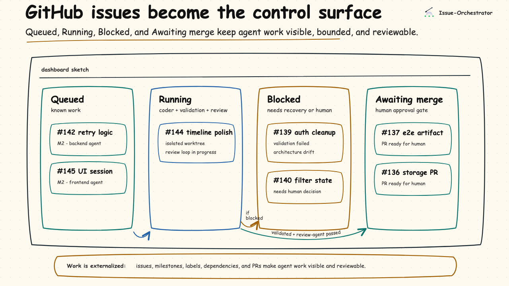
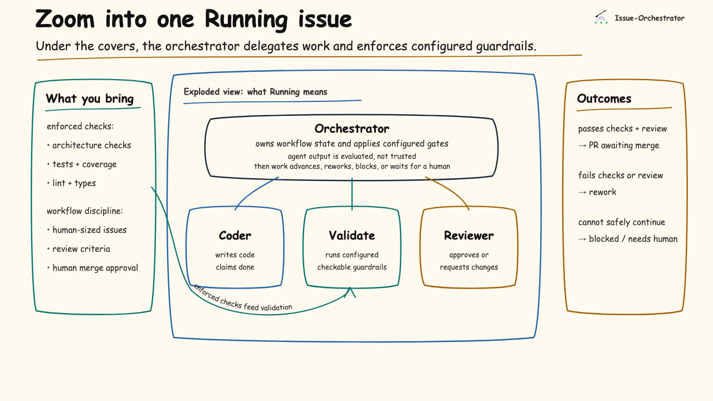
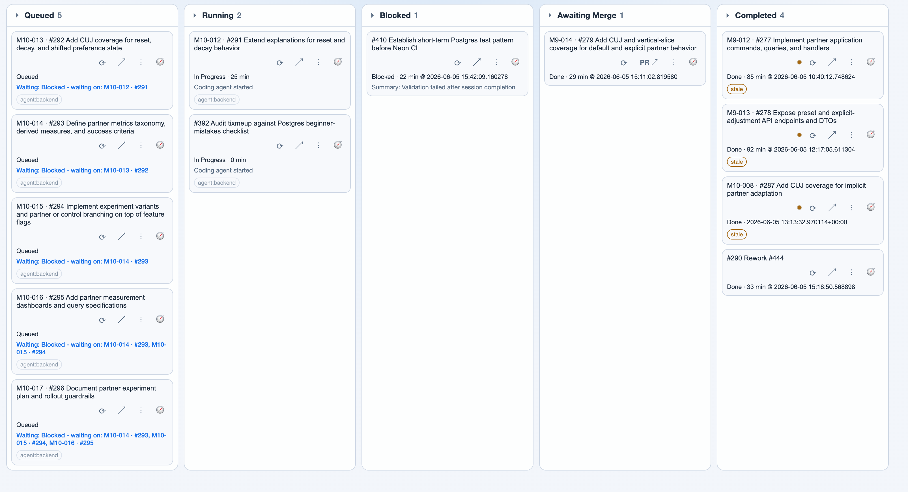
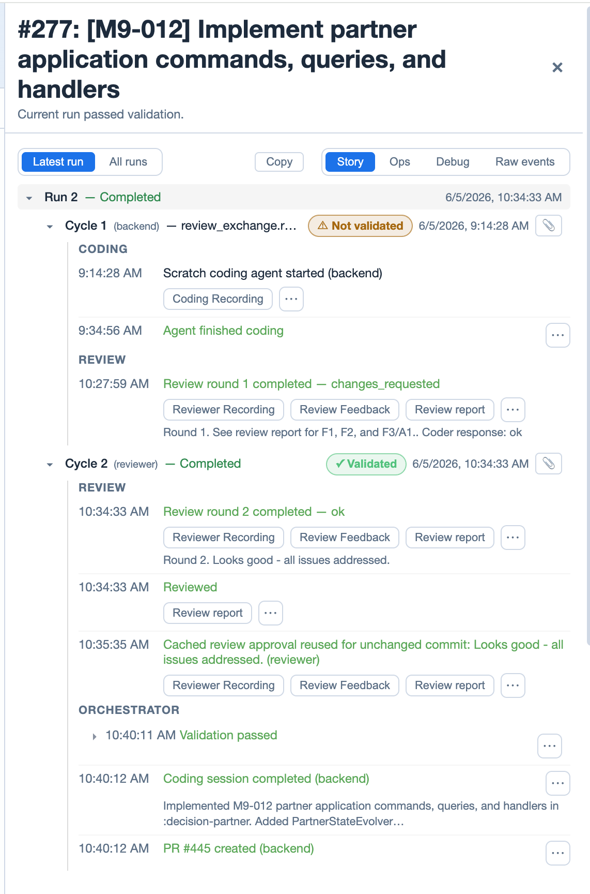

#  Issue-Orchestrator

Issue-Orchestrator is a control plane for coding agents built around software engineering discipline. It turns GitHub issues into bounded agent runs in isolated worktrees, then advances code only through the validation, review, recovery, and human approval gates you define.

It is built for teams that want agent throughput without handing agents authority over system quality. Agents produce changes; the orchestrator decides whether those changes move forward, go back to rework, or need a human.

Issue-Orchestrator works best when your project has explicit engineering standards: named architecture, enforced validation, code review, human-sized issues, and human merge authority.



## What it does

Issue-Orchestrator turns GitHub issues into bounded, reviewable execution runs:

- Claims eligible GitHub issues and routes them to configured agent types.
- Creates an isolated git worktree per issue so agents can work concurrently.
- Runs coding, review, rework, and triage sessions through configured agent providers.
- Treats agent completion as untrusted input, then validates the exact commit produced.
- Enforces validation, review, bounded rework, reconciliation, and publish gates before work is ready for human merge.
- Uses GitHub labels and observed worktree state as crash-safe external truth.
- Surfaces timelines, structured events, validation artifacts, diagnostics, transcripts, and session replay for review.

Under the dashboard, each Running issue is an enforced workflow, not an agent free-for-all:



## Project quality contract

Issue-Orchestrator does not know what "good" means for your codebase. Your project brings the engineering standard; the orchestrator makes that standard enforceable inside the agent workflow.

- **Work shape:** milestones, right-sized GitHub issues, dependencies, labels, and reviewable pull requests.
- **Quality standard:** tests, linting, type checks, coverage gates, architecture checks, complexity checks, review criteria, CI, and branch protection.
- **Guardrails:** AI hooks, git hooks, credential scoping, validation records, publish gates, and human merge authority.
- **Operational control:** isolated worktrees, bounded review/rework, crash recovery, reconciliation before mutation, transcripts, diagnostics, and artifacts.
- **Ongoing improvement:** agents can help draft tests, guardrails, coverage gates, ADRs, issue breakdowns, and failure triage summaries. Humans decide what is good enough to enforce.

## Dashboard

The dashboard is the concrete control surface: issues flow through Queued, Running, Blocked, Awaiting Merge, and Completed columns. Selecting an issue opens its timeline: review cycles, rework rounds, validation results, session recordings, transcripts, and failure diagnostics.



Behind that view, each issue moves through an explicit state machine backed by GitHub labels and isolated worktrees. Before advancing work, the orchestrator re-observes GitHub and the worktree, so crashes, human edits, dirty trees, and provider failures become recoverable states instead of silent corruption.

The timeline makes the evidence inspectable: a review can request changes, feedback can be addressed and re-reviewed, validation can pass on the reviewed commit, and the orchestrator can publish a PR for human merge.



Timeline artifact buttons open details such as reviewer feedback, review reports, validation artifacts, and replayable coding sessions:


Session recordings let you see exactly what an agent did: terminal output rendered in an emulator replay. This is useful for debugging failures, auditing completion claims, and understanding why an issue moved to rework or needs-human.

Any client can connect: browser, VS Code ([MCP integration](docs/user/vscode.md)), or AI agents via the REST API.

## Guardrails

The operating rule is agent intent, orchestrator authority. Agents report what they did and what they want; the orchestrator re-observes GitHub, worktrees, validation records, and review output before changing state.

Agents cannot merge PRs. Humans merge. Validation runs automatically before code can advance, and it can include tests, linting, type checks, architecture checks, and repo-specific policy scans.

[Multi-layer hooks](docs/architecture/hooks.md) enforce these rules at the AI-agent level, git level, orchestrator level, and CI. The guardrails are installed and verified, not just described. See [Guardrails & Safety Model](docs/design/guardrails.md) for the guarantee and limitation boundaries.

## Who it's for

- Solo builders and small teams using coding agents on real repos.
- Teams willing to encode architecture, validation, and review standards as enforceable project contracts.
- People who want strong safety and guardrails: humans merge, verification gates, reconciliation, and inspectable artifacts.

It is a poor fit for one-off prompt-and-patch work, repos without CI or branch protection, or projects that have not decided what standards agents should be held to.

## Is your repo ready?

The orchestrator works best on repos with basic discipline: PR-required branches, CI that gates merge, architecture you can name, tests at public boundaries, and a culture of adding tests when you add code. Under-disciplined repos burn cycles fixing CI, fighting flaky tests, and rediscovering layer boundaries.

To assess a target repo before scaling agent work, ask your AI assistant to use the [`readiness` skill](.claude/skills/readiness/SKILL.md). Request read-only mode if you want the assessment limited to static inspection and read-only API calls.

## Quickstart

```bash
make venv                              # creates .venv with uv + correct Python
source .venv/bin/activate
cd /path/to/your/project               # run setup/start in the repo you want to automate
export ISSUE_ORCH_GITHUB_TOKEN=ghp_...
issue-orchestrator setup
issue-orchestrator setup-guardrails    # if you skipped the wizard prompt
issue-orchestrator init
# review, commit, and push the generated onboarding files (or set worktrees.seed_ref: HEAD)
issue-orchestrator doctor
issue-orchestrator start
```

Run the setup/start commands from the target repo, not from the `issue-orchestrator` checkout. Before `start`, commit and push the generated onboarding files to the worktree seed ref (by default `origin/<default-branch>`), or set `worktrees.seed_ref: HEAD` if you're doing local-only evaluation. You'll also need a supported AI coding CLI installed. See [Installation](docs/user/installation.md) and [Quickstart Guide](docs/user/quickstart.md) for detailed setup, prerequisites, and configuration.

If you want your AI assistant to drive the setup for you, use the [Agent-Guided Onboarding](docs/journeys/agent-guided-onboarding.md) path.

## Project status

**Early beta** - Core orchestration, guardrails, review workflow, and the web dashboard are stable and in daily use. External setup is usable but still being hardened; some integrations are newer and APIs may change.

Issue-Orchestrator dogfoods the same discipline it expects from target repos: hexagonal architecture, import-linter and AST guardrails, ADRs, and a large automated test suite. See [Issue-Orchestrator Internal Architecture](docs/architecture/internal-architecture.md) for the implementation architecture.

## Documentation

Pick the path that fits:

- **[Getting Started](docs/journeys/getting-started.md)** - Install, configure, run your first issue
- **[Agent-Guided Onboarding](docs/journeys/agent-guided-onboarding.md)** - Let an AI assistant drive setup and first-run validation
- **[A Software Engineering Control Plane for Agentic Development](docs/journeys/software-engineering-control-plane.md)** - The public thesis and visual walkthrough
- **[Developing](docs/journeys/developing.md)** - Dev setup, conventions, testing, how to make changes

Reference docs:

- **User:** [Installation](docs/user/installation.md) · [Tutorial](docs/user/tutorial.md) · [Configuration](docs/user/configuration.md) · [Configuration Reference](docs/user/configuration_reference.md) · [FAQ](docs/user/faq.md)
- **Architecture:** [Overview](docs/architecture/README.md) · [Internal Architecture](docs/architecture/internal-architecture.md) · [ADRs](docs/architecture/ADR/README.md) · [Guardrails](docs/design/guardrails.md) · [Hooks](docs/architecture/hooks.md)
- **Development:** [Testing](docs/development/TESTING.md) · [Creating Guardrails](docs/development/CREATE_GUARDRAILS.md) · [Troubleshooting](docs/development/TROUBLESHOOTING.md) · [Review Workflow](docs/development/REVIEW_WORKFLOW.md)
- **Features:** [E2E Runner](docs/user/e2e.md) · [VS Code](docs/user/vscode.md)

## License and contributions

Issue-Orchestrator is licensed under the Apache License, Version 2.0. See
[LICENSE](LICENSE) and [NOTICE](NOTICE).

Contributions require Developer Certificate of Origin sign-off. This project
does not require a CLA today, and there is no proprietary split in this
repository. See [CONTRIBUTING.md](CONTRIBUTING.md) for the sign-off process
and contribution terms.

The Issue-Orchestrator name, logos, and project marks are retained by Bruce
Gordon. The Apache-2.0 license grants rights to the code; it does not grant
trademark or brand rights except for reasonable and customary use in describing
the origin of the software.
