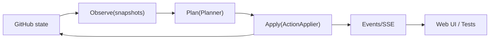
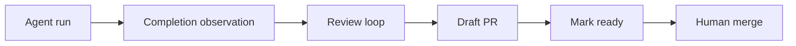

# Issue-Orchestrator

## What it is
Issue-Orchestrator is a local-first control plane that turns GitHub issues into a managed agent workflow (code -> review -> PR), with guardrails for untrusted agents.

## Who it's for
- Solo builders and small teams using coding agents on real repos
- People who want strong safety/guardrails (humans merge, verification, reconciliation)

## Who it's not for
- Teams seeking a hosted SaaS orchestrator
- Workflows where agents must merge directly

## Guarantees (guardrails)
1) **Humans merge**: the orchestrator/agents never merge PRs.
2) **Write->Observe**: correctness-critical writes are verified by observation before state advances.
3) **Reconciliation-first**: drift pauses/quarantines work; state never "guesses".

## Main first workflow
Issue-Orchestrator is designed around a main-first development flow.

Currently:
•	All issues are assumed to work against the main branch.
•	Worktrees are created from origin/main.
•	Pull requests target main.
•	Dependencies are evaluated within this single branch context.

This design keeps the system predictable and easy to reason about, especially during recovery and reconciliation.

Branch-specific workflows
Branch-specific workflows (for example, targeting release or stabilization branches) are not currently supported.

This is an intentional design choice to avoid:
•	cross-branch dependency complexity
•	ambiguous PR targeting
•	harder recovery and reconciliation logic

Support for issue-specific base branches may be added in the future, with strict constraints, if real-world usage requires it.

## Quickstart
```bash
python -m venv .venv && source .venv/bin/activate
pip install -e ".[dev]"
export ISSUE_ORCH_GITHUB_TOKEN=ghp_...
issue-orchestrator setup
issue-orchestrator run --once
```

## How it works




## Async E2E Test Runner

Built-in facility for running end-to-end tests asynchronously with full visibility in the web dashboard.

**Highlights:**
- **Progress tracking** - Watch tests execute in real-time with live progress bar and current test display
- **Resumable runs** - If interrupted, automatically resumes from where it left off (skipping passed tests)
- **Retry-once policy** - Flaky tests get one automatic retry before marking as failed
- **Quarantine support** - Known-flaky tests tracked separately, excluded from failure counts
- **Signal score** - Track E2E stability over time ("94% pass rate over 30 runs")
- **Survives restarts** - E2E worker continues running even if orchestrator restarts

**Quick start:**
```yaml
# .issue-orchestrator/config/default.yaml
e2e:
  enabled: true
  auto_run_interval_minutes: 30
  pytest_args: ["tests/e2e", "-v"]
  allow_retry_once: true
```

**Dashboard shows:**
- Live progress: `12/19 tests (63%) - 10✓ 2✗`
- Current test being executed
- Signal score with quarantine count
- Detailed breakdown: passed, failed, passed-on-retry, quarantined

**API endpoints:**
- `POST /control/e2e/start` - Start E2E run (or cancel and restart if running)
- `POST /control/e2e/stop` - Cancel running E2E
- `GET /control/e2e/status` - Get status with progress
- `GET /control/e2e/summary/{run_id}` - Full test breakdown
- `GET /control/e2e/quarantine` - View quarantine list

See [E2E Documentation](docs/user/e2e.md) for full configuration reference, API details, database schema, and troubleshooting.

## Experimental: Goal Pilot

> **Status:** Experimental / Opt-in
> **Role:** Autonomous Control Plane

The **Goal Pilot** is an experimental agentic layer built *on top* of the stable Issue-Orchestrator core. 

While the core orchestrator provides a deterministic, Hexagonal Architecture platform for managing lifecycle events (the "engine"), the Goal Pilot acts as an autonomous driver. It replaces the passive human operator with an agentic loop that can reason about high-level goals.

### Why this architecture?
We explicitly separated the **Stable Core** from the **Experimental Pilot** to ensure safety and reliability.

*   **The Core (Stable):** Handles the mechanics—moving tickets, running checks, syncing state. It is deterministic, strictly typed, and heavily tested.
*   **The Pilot (Experimental):** Handles the *decisions*. It consumes the same public Ports/Adapters as the CLI. 

### Key Capabilities
*   **Goal-Oriented:** Takes high-level intent (e.g., "Implement feature X") and breaks it down into actions.
*   **Safe by Design:** The Pilot is constrained to the safety guarantees of the underlying platform. It cannot bypass validations, merge PRs, or violate architectural boundaries.
*   **Resumable "Brain":** The Pilot's state is persisted in a dedicated SQLite store, making the agent's reasoning process durable and auditable.

**Note:** This layer is strictly opt-in. You can use `issue-orchestrator` as a standard, deterministic CLI tool without ever enabling the autonomous components.

## Guardrails & Safety Model

Issue-Orchestrator is designed to assist humans, not replace trust boundaries.
Agents are powerful, but they are constrained by explicit guardrails at multiple layers.

What the system guarantees
•	Agents cannot publish code directly.
All publishing is gated by a mandatory validation step (make validate) and enforced by the orchestrator and CI.
•	Humans always merge.
Branch protection is assumed; agents may create draft PRs but never merge.
•	Architecture boundaries are enforced.
Control, domain, and ports layers cannot perform side effects (e.g. subprocesses, HTTP calls). Violations fail fast.
•	Validation is the single source of truth.
The same validation gate runs locally, in CI, and in orchestrated workflows.

How guardrails are enforced
•	Local hooks provide fast feedback before pushes.
•	Orchestrator policy enforces validation regardless of local hooks.
•	CI re-runs the canonical gate in a clean environment.
•	Static guardrails (AST + import checks) prevent architectural drift.

The system assumes agents can make mistakes.
It is explicitly designed so mistakes cannot bypass safety.

What the system does not claim
•	Local agent execution on macOS is best-effort isolated, not a hardened sandbox.
•	Absolute-path execution (e.g. /usr/bin/*) cannot be fully prevented locally.
•	For strong isolation, container or CI-based execution is a future option.

This is an intentional trade-off in favor of developer ergonomics and transparency.

Learn more
•	Architecture boundaries: docs/design/BOUNDARIES.md
•	Validation & publishing policy: docs/design/VALIDATION.md
•	Threat model & trust assumptions: docs/design/THREAT_MODEL.md

## Documentation
- [docs/](docs/README.md) - Full documentation index
- [docs/architecture/](docs/architecture/README.md) - System design & ADRs
