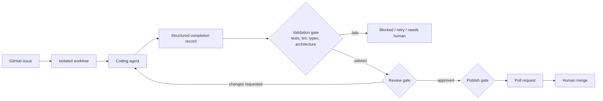
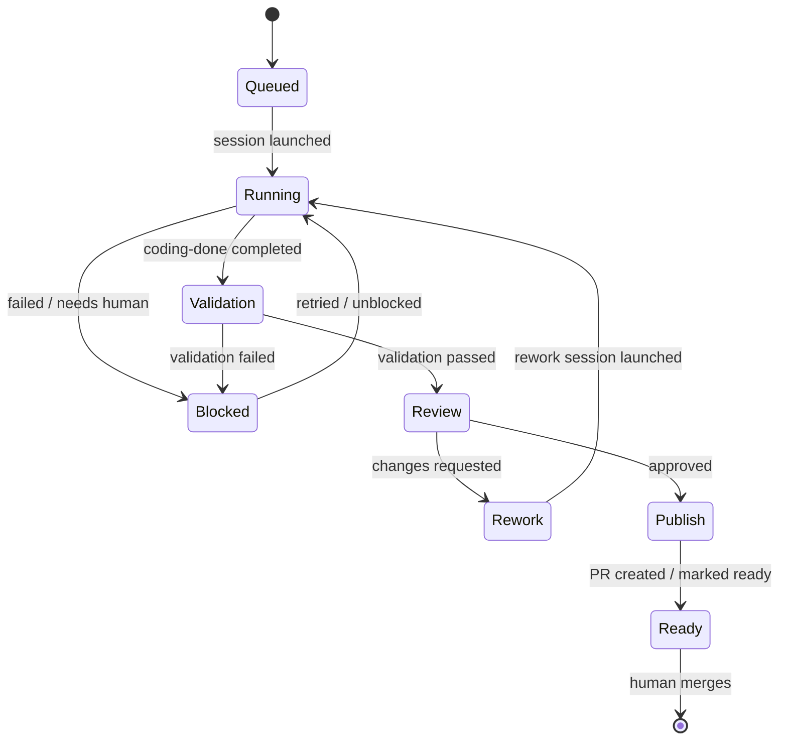
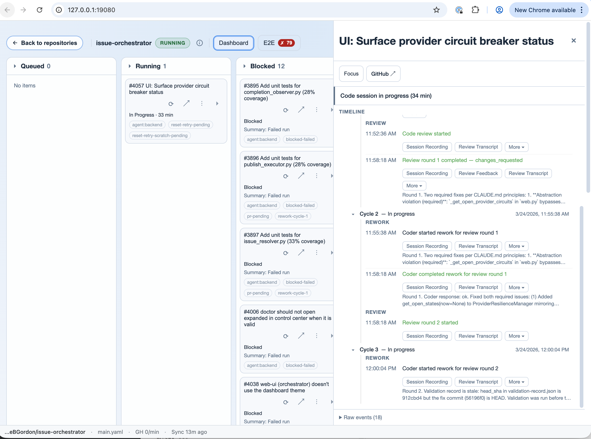
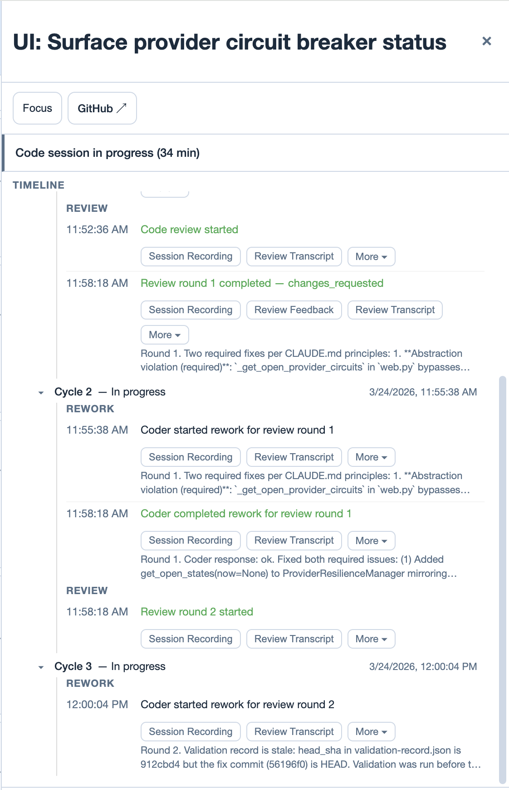
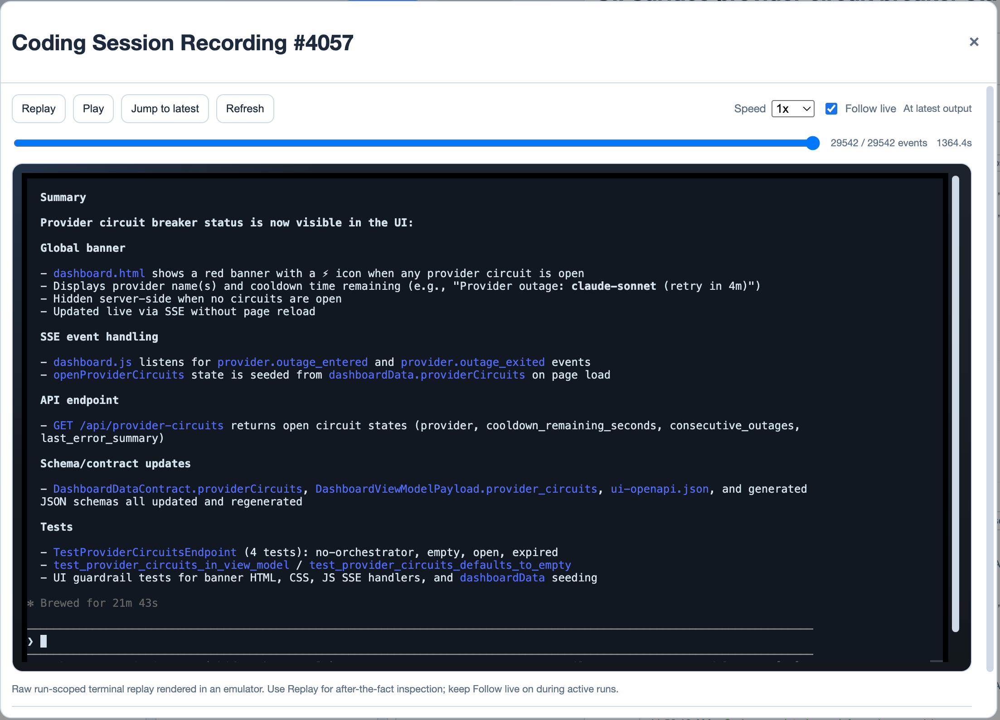

# Issue-Orchestrator

Issue-Orchestrator is a control plane for AI-assisted software work. It takes GitHub issues, runs coding and review agents in isolated worktrees, and advances code only through the validation, review, recovery, and human-merge gates you define.

The goal is not to make agents trusted maintainers. The goal is to let agents contribute bounded work while the project keeps authority over quality. Agents produce changes; the orchestrator decides whether those changes move forward, go back to rework, or need a human.

> **▶ 2-minute walkthrough:** _video coming soon_
>
> **Core thesis:** read [No Free Lunch for Coding Agents](docs/journeys/no-free-lunch.md).
> For the design backstory, see [Making Agentic Development Sustainable](docs/design/sustainable-agentic-development.md).

## What it does

Issue-Orchestrator turns GitHub issues into bounded, reviewable execution runs:

- Claims eligible GitHub issues and routes them to configured agent types.
- Creates an isolated git worktree per issue so agents can work concurrently without sharing dirty state.
- Launches coding, review, rework, or triage sessions through provider adapters.
- Requires agents to finish through structured `coding-done` / `reviewer-done` completion commands.
- Treats completion as untrusted input, then runs validation, review, reconciliation, and publish gates.
- Stores validation records keyed to the current commit so progress depends on the code that was actually checked.
- Runs reviewer agents and bounded rework loops before code is publish-ready.
- Uses GitHub labels and observed worktree state as crash-safe external truth.
- Surfaces timelines, structured events, validation artifacts, diagnostics, transcripts, and session replay for debugging.



The default review exchange runs locally before PR creation. Draft-PR mode can create a draft PR earlier for GitHub-based review, but the authority is the same: no passing validation, no approved review, no publish-ready PR.

## Project quality contract

Issue-Orchestrator does not know what "good" means for your codebase. Your project brings the engineering standard; the orchestrator makes that standard hard for agents to ignore.

- **Work shape:** milestones, right-sized GitHub issues, dependencies, labels, and reviewable pull requests.
- **Quality standard:** tests, linting, type checks, coverage gates, architecture checks, complexity checks, review criteria, CI, and branch protection.
- **Guardrails:** AI hooks, git hooks, credential scoping, validation records, publish gates, and human merge authority.
- **Operational control:** isolated worktrees, bounded review/rework, crash recovery, reconciliation before mutation, transcripts, diagnostics, and artifacts.
- **Ongoing improvement:** agents can help draft tests, guardrails, coverage gates, ADRs, issue breakdowns, and failure triage summaries. Humans decide what is good enough to enforce.

For the product thesis, see [No Free Lunch for Coding Agents](docs/journeys/no-free-lunch.md) and [Guardrails & Safety Model](docs/design/guardrails.md).

## Design principles

AI agents are untrusted workers. They can be useful contributors, but they optimize for task completion unless the system enforces a stronger standard.

- **Mechanical enforcement over documentation** - AI hooks block unsafe commands before execution, git hooks validate before push, the orchestrator requires passing validation records before advancing state, and CI re-validates in a clean environment.
- **Agent intent, orchestrator authority** - Agents report what they did and what they want. The orchestrator validates that input and decides what happens next.
- **Observe-Plan-Apply loop** - Each tick gathers facts, decides actions, then applies changes through ports. Decision logic stays testable without I/O.
- **Labels as crash-safe truth** - GitHub labels persist outside the process, so restart recovery can reconstruct issue state after crashes or human edits.
- **Fail-fast by default** - Unexpected state should fail loudly instead of hiding bugs behind silent fallback behavior.

## How this repo is built

The product contract above is what Issue-Orchestrator enforces for target repos. Separately, this repository has its own internal architecture and quality proof.

Issue-Orchestrator itself is built around hexagonal architecture: Protocol ports in `src/issue_orchestrator/ports/`, adapters for external systems, a single composition root in `entrypoints/bootstrap.py`, import-linter and AST guardrails, ADRs, and tests that mock at port boundaries. That internal structure keeps orchestrator policy testable without GitHub, terminals, storage, or UI dependencies.

See [Issue-Orchestrator Internal Architecture](docs/architecture/internal-architecture.md) for the implementation architecture.

## Issue lifecycle

Each issue moves through a deterministic state machine. Labels and worktrees are observed before mutation, so the orchestrator can recover from crashes and reconcile human changes before advancing state.



## Dashboard



The dashboard gives you a live view of what the orchestrator is doing: issues flow through Queued, Running, Blocked, and Awaiting Merge columns. Click any issue to see its full timeline - review cycles, rework rounds, session recordings, and failure diagnostics.



Each issue's timeline shows the complete history: when code review started, what the reviewer found, how many rework cycles it took, and links to session recordings and transcripts.



Session recordings let you see exactly what an agent did: terminal output rendered in an emulator replay. This is useful for debugging failures, auditing completion claims, and understanding why an issue moved to rework or needs-human.

Any client can connect: browser, VS Code ([MCP integration](docs/user/vscode.md)), or AI agents via the REST API.

## Guardrails

Agents cannot merge PRs. Humans merge. Validation runs automatically before code can advance, and it can include tests, linting, type checks, architecture checks, and repo-specific policy scans.

[Multi-layer hooks](docs/architecture/hooks.md) enforce these rules at the AI-agent level, git level, orchestrator level, and CI. The guardrails are installed and verified, not just described. See [Guardrails & Safety Model](docs/design/guardrails.md) for the guarantee and limitation boundaries.

## Is your repo ready?

The orchestrator works best on repos with basic discipline: PR-required branches, CI that gates merge, architecture you can name, tests at public boundaries, and a culture of adding tests when you add code. Under-disciplined repos burn cycles — fixing CI, fighting flaky tests, rediscovering layer boundaries.

Ask your AI assistant (Claude Code, Codex, or similar) to use the `readiness` skill in this repo (at [`.claude/skills/readiness/SKILL.md`](.claude/skills/readiness/SKILL.md)) to assess a target repo before scaling agent work on it. The skill is conversational and grades the target against 11 pillars (PR/CI discipline, architecture documented + enforced, tests at boundaries, mechanical DoD, reviewer in place, issue sizing, abstraction quality, deep modules, tests grow with code), producing a punch list of fixes.

Request **read-only mode** in your prompt (e.g., "use the readiness skill in read-only mode") if you want the assessment bounded to static inspection and read-only API calls — no installs, probes, or remote writes. In Claude Code, the skill is also auto-discoverable via the skill system when this repo is the working directory. v0.1 — expect rough edges and iteration.

## Quickstart

```bash
make venv                              # creates .venv with uv + correct Python
source .venv/bin/activate
cd /path/to/your/project               # run setup/start in the repo you want to automate
export ISSUE_ORCH_GITHUB_TOKEN=ghp_...
issue-orchestrator setup
issue-orchestrator setup-guardrails    # if you skipped the wizard prompt
issue-orchestrator init
# review, commit, and push the generated onboarding files (or set worktrees.seed_ref: HEAD)
issue-orchestrator doctor
issue-orchestrator start
```

Run the setup/start commands from the target repo, not from the `issue-orchestrator` checkout. Before `start`, commit and push the generated onboarding files to the worktree seed ref (by default `origin/<default-branch>`), or set `worktrees.seed_ref: HEAD` if you're doing local-only evaluation. You'll also need a supported AI coding CLI installed. See [Installation](docs/user/installation.md) and [Quickstart Guide](docs/user/quickstart.md) for detailed setup, prerequisites, and configuration.

If you want your AI assistant to drive the setup for you, use the [Agent-Guided Onboarding](docs/journeys/agent-guided-onboarding.md) path.

## More

**Async E2E Test Runner** - Background test execution with progress tracking, resumable runs, flake detection, quarantine support, and signal scoring. Survives orchestrator restarts. See [E2E documentation](docs/user/e2e.md).

**Goal Pilot** *(planned)* - A designed-but-not-yet-implemented agentic layer that would take high-level goals and break them into orchestrator actions, constrained by the same safety guarantees as the core. See [user guide](docs/user/goal_pilot.md) and [design document](docs/design/goal-pilot.md).

## Who it's for

- Solo builders and small teams using coding agents on real repos
- Teams willing to encode architecture, validation, and review standards as enforceable project contracts
- People who want strong safety and guardrails: humans merge, verification gates, reconciliation, and inspectable artifacts

## Project status

**Beta** - Core orchestration, guardrails, review workflow, and the web dashboard are stable and in daily use. The E2E test runner is newer and still maturing. Goal Pilot is a planned feature, not yet implemented. APIs may change.

~100K lines of Python, a large automated test suite, and architecture decision records.

## Documentation

Pick the path that fits:

- **[Getting Started](docs/journeys/getting-started.md)** - Install, configure, run your first issue
- **[Agent-Guided Onboarding](docs/journeys/agent-guided-onboarding.md)** - Let an AI assistant drive setup and first-run validation
- **[No Free Lunch for Coding Agents](docs/journeys/no-free-lunch.md)** - Why the engineering contract matters more than the issue runner
- **[Developing](docs/journeys/developing.md)** - Dev setup, conventions, testing, how to make changes

Reference docs:

- **User:** [Installation](docs/user/installation.md) · [Tutorial](docs/user/tutorial.md) · [Configuration](docs/user/configuration.md) · [Configuration Reference](docs/user/configuration_reference.md) · [FAQ](docs/user/faq.md)
- **Architecture:** [Overview](docs/architecture/README.md) · [Internal Architecture](docs/architecture/internal-architecture.md) · [ADRs](docs/architecture/ADR/README.md) · [Guardrails](docs/design/guardrails.md) · [Hooks](docs/architecture/hooks.md)
- **Development:** [Testing](docs/development/TESTING.md) · [Creating Guardrails](docs/development/CREATE_GUARDRAILS.md) · [Troubleshooting](docs/development/TROUBLESHOOTING.md) · [Review Workflow](docs/development/REVIEW_WORKFLOW.md)
- **Features:** [E2E Runner](docs/user/e2e.md) · [Goal Pilot](docs/user/goal_pilot.md) · [VS Code](docs/user/vscode.md)
