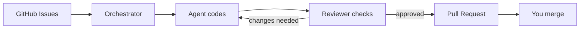

# Issue-Orchestrator

Issue-Orchestrator takes GitHub issues, runs AI agents on them with guardrails, and produces pull requests for you to merge.

AI agents are excellent at executing bounded tasks, but they optimize for completion, not long-term system health. Issue-Orchestrator provides the structure: enforced validation, automated code review, architecture boundary checks, and isolated worktrees — so agents can work in parallel while you stay in control.

> **Evaluating the engineering?** Read [Making Agentic Development Sustainable](docs/design/sustainable-agentic-development.md) for the design thinking, then [Evaluating the System](docs/journeys/evaluating.md) for architecture decisions and where to read code.

## Design philosophy

The core insight: AI agents are untrusted workers. They'll take shortcuts, skip tests, and push broken code if you let them. Issue-Orchestrator treats agent output the way a good CI pipeline treats developer commits — verify everything mechanically, never trust intent. For the full narrative, see [Making Agentic Development Sustainable](docs/design/sustainable-agentic-development.md).

- **Hexagonal architecture** — Core logic has no knowledge of GitHub, terminals, or storage. ~26 Protocol interfaces define the boundary. Adapters are swappable; the domain is pure.
- **Crash-safe state** — GitHub labels are the source of truth. If the orchestrator dies mid-operation, it recovers state from labels on restart. No orphaned worktrees, no stuck issues.
- **Mechanical enforcement over documentation** — AI hooks block unsafe commands before execution, git hooks validate before push, the orchestrator requires a passing validation record before advancing state, and CI re-validates in a clean environment. Agents cannot get unvalidated code merged. See [Guardrails](docs/design/guardrails.md).
- **Observe-Plan-Apply loop** — Each tick gathers facts (observation), decides actions (planning), then executes (application). Clean separation means decisions are testable without I/O.
- **Fail-fast by default** — No silent fallbacks. If something is wrong, the system crashes loudly rather than hiding the bug behind a default value.

## How it works

The orchestrator picks up GitHub issues, assigns them to AI agents, and manages the full lifecycle through to a merge-ready PR.



The agent-reviewer loop is the core of quality enforcement. When an agent finishes coding, a reviewer agent checks the work. If changes are needed, the coder fixes and the reviewer re-checks — with cycle limits to prevent infinite loops. The orchestrator mediates, and only creates a PR once code is approved. (The loop [can also run via a draft PR](docs/development/REVIEW_WORKFLOW.md) on GitHub.)

### Issue lifecycle

Every issue moves through a state machine. Labels on GitHub and the worktrees each agent uses are the source of truth — if the orchestrator crashes, it recovers state from labels and worktrees on restart.


## Dashboard


The dashboard gives you a live view of what the orchestrator is doing: issues flow through Queued, Running, Blocked, and Awaiting Merge columns. Click any issue to see its full timeline — review cycles, rework rounds, session recordings, and failure diagnostics.


Each issue's timeline shows the complete history: when code review started, what the reviewer found, how many rework cycles it took, and links to session recordings and transcripts.


Session recordings let you see exactly what an agent did — the terminal output, rendered in an emulator replay. Useful for debugging failures and understanding agent behavior.

Any client can connect: browser, VS Code ([MCP integration](docs/user/vscode.md)), or AI agents via the REST API.

## Guardrails

Agents cannot merge PRs — only humans merge. Validation (tests, linting, architecture checks) runs automatically before any code is pushed. [Multi-layer hooks](docs/architecture/hooks.md) enforce these rules at the AI agent level, git level, orchestrator level, and CI — agents cannot bypass them. See [Guardrails & Safety Model](docs/design/guardrails.md) for details.

## Quickstart

```bash
make venv                              # creates .venv with uv + correct Python
source .venv/bin/activate
export ISSUE_ORCH_GITHUB_TOKEN=ghp_...
issue-orchestrator setup
issue-orchestrator start
```

See [Installation](docs/user/installation.md) and [Quickstart Guide](docs/user/quickstart.md) for detailed setup, prerequisites, and configuration.

## More

**Async E2E Test Runner** — Background test execution with progress tracking, resumable runs, flake detection, quarantine support, and signal scoring. Survives orchestrator restarts. See [E2E documentation](docs/user/e2e.md).

**Goal Pilot** *(experimental, opt-in)* — An agentic layer that takes high-level goals and breaks them into orchestrator actions. Constrained by the same safety guarantees as the core. See [user guide](docs/user/goal_pilot.md) and [design document](docs/design/goal-pilot.md).

## Who it's for

- Solo builders and small teams using coding agents on real repos
- People who want strong safety and guardrails (humans merge, verification, reconciliation)

## Project status

**Beta** — Core orchestration, guardrails, review workflow, and the web dashboard are stable and in daily use. The E2E test runner and Goal Pilot are newer and still maturing. APIs may change.

~100K lines of Python, 4500+ automated tests, 24 architecture decision records.

For guidance on what is stable and where to read code, see [Evaluating the System](docs/journeys/evaluating.md).

## Documentation

Pick the path that fits:

- **[Getting Started](docs/journeys/getting-started.md)** — Install, configure, run your first issue
- **[Evaluating the System](docs/journeys/evaluating.md)** — Architecture, guardrails, quality signals, where to read code
- **[Developing](docs/journeys/developing.md)** — Dev setup, conventions, testing, how to make changes

Reference docs:

- **User:** [Installation](docs/user/installation.md) · [Tutorial](docs/user/tutorial.md) · [Configuration](docs/user/configuration.md) · [Configuration Reference](docs/user/configuration_reference.md) · [FAQ](docs/user/faq.md)
- **Architecture:** [Overview](docs/architecture/README.md) · [ADRs](docs/architecture/ADR/README.md) · [Guardrails](docs/design/guardrails.md) · [Hooks](docs/architecture/hooks.md)
- **Development:** [Testing](docs/development/TESTING.md) · [Troubleshooting](docs/development/TROUBLESHOOTING.md) · [Review Workflow](docs/development/REVIEW_WORKFLOW.md)
- **Features:** [E2E Runner](docs/user/e2e.md) · [Goal Pilot](docs/user/goal_pilot.md) · [VS Code](docs/user/vscode.md)
