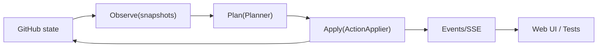
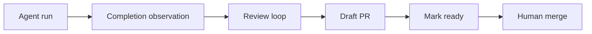

# Issue-Orchestrator

## What it is
Issue-Orchestrator is a local-first control plane that turns GitHub issues into a managed agent workflow (code -> review -> PR), with guardrails for untrusted agents.

## Who it's for
- Solo builders and small teams using coding agents on real repos
- People who want strong safety/guardrails (humans merge, verification, reconciliation)

## Who it's not for
- Teams seeking a hosted SaaS orchestrator
- Workflows where agents must merge directly

## Guarantees (guardrails)
1) **Humans merge**: the orchestrator/agents never merge PRs.
2) **Write->Observe**: correctness-critical writes are verified by observation before state advances.
3) **Reconciliation-first**: drift pauses/quarantines work; state never "guesses".

## Quickstart
```bash
python -m venv .venv && source .venv/bin/activate
pip install -e ".[dev]"
export ISSUE_ORCH_GITHUB_TOKEN=ghp_...
issue-orchestrator setup
issue-orchestrator run --once
```

## How it works



## Guardrails & Safety Model

Issue-Orchestrator is designed to assist humans, not replace trust boundaries.
Agents are powerful, but they are constrained by explicit guardrails at multiple layers.

What the system guarantees
•	Agents cannot publish code directly.
All publishing is gated by a mandatory validation step (make validate) and enforced by the orchestrator and CI.
•	Humans always merge.
Branch protection is assumed; agents may create draft PRs but never merge.
•	Architecture boundaries are enforced.
Control, domain, and ports layers cannot perform side effects (e.g. subprocesses, HTTP calls). Violations fail fast.
•	Validation is the single source of truth.
The same validation gate runs locally, in CI, and in orchestrated workflows.

How guardrails are enforced
•	Local hooks provide fast feedback before pushes.
•	Orchestrator policy enforces validation regardless of local hooks.
•	CI re-runs the canonical gate in a clean environment.
•	Static guardrails (AST + import checks) prevent architectural drift.

The system assumes agents can make mistakes.
It is explicitly designed so mistakes cannot bypass safety.

What the system does not claim
•	Local agent execution on macOS is best-effort isolated, not a hardened sandbox.
•	Absolute-path execution (e.g. /usr/bin/*) cannot be fully prevented locally.
•	For strong isolation, container or CI-based execution is a future option.

This is an intentional trade-off in favor of developer ergonomics and transparency.

Learn more
•	Architecture boundaries: docs/design/BOUNDARIES.md
•	Validation & publishing policy: docs/design/VALIDATION.md
•	Threat model & trust assumptions: docs/design/THREAT_MODEL.md

## Documentation
- [docs/](docs/README.md) - Full documentation index
- [docs/architecture/](docs/architecture/README.md) - System design & ADRs
