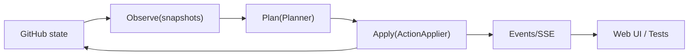
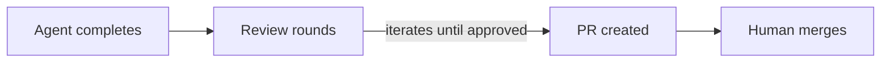
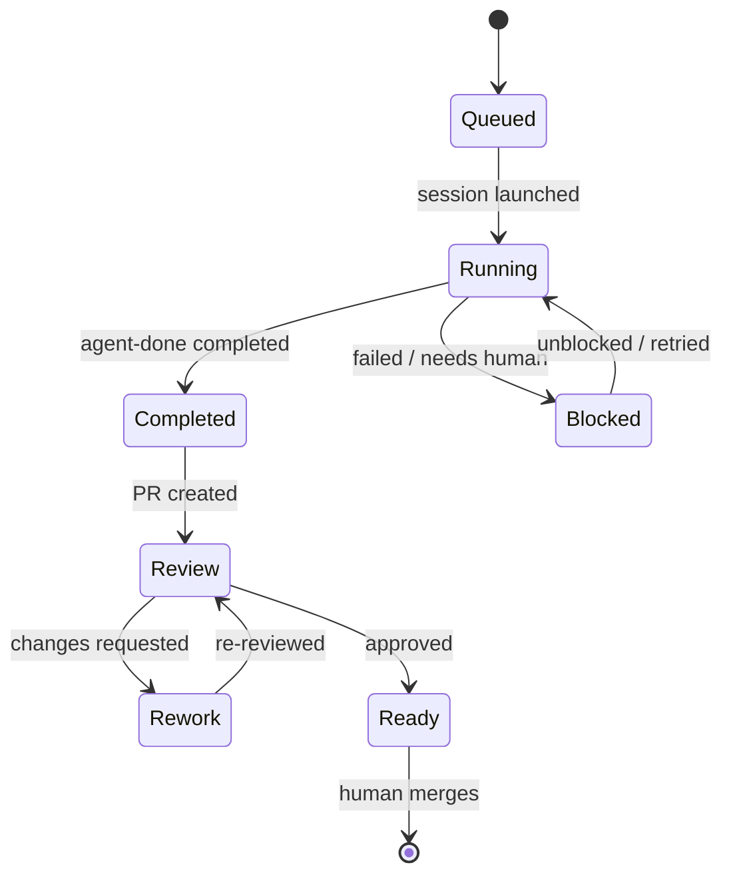

# Issue-Orchestrator

**Issue-Orchestrator** is a local-first control plane for AI-assisted software development that enforces architectural boundaries, validation gates, and review workflows rather than relying on agent discipline or prompts alone.

The core premise is simple:
AI agents are excellent at executing bounded tasks, but they optimize for completion, not long-term system health. Sustainable agentic development requires explicit structure, enforced workflows, and guardrails that cannot be bypassed.

Issue-Orchestrator processes GitHub issues through a deterministic workflow:
- architecture is enforced via import-linter and custom AST guardrails
- validation and review gates must pass before progress
- agents execute work in isolated worktrees with minimal permissions
- retries, failures, and provider outages are handled explicitly
- humans approve all pull requests

The system is designed as a **UI-agnostic control plane**, with decoupled operator interfaces (currently a local web UI and IDE-integrated clients) layered on top.

---

## Project Status

This project is under **active development**.

- Core orchestration, guardrails, and workflow enforcement are stable.
- Some integrations and higher-level planning experiments are evolving.
- APIs and internals may change as the system is refined.

The repository is public to support discussion, review, and hiring conversations.
For guidance on where to focus, see [REVIEWER_README.md](REVIEWER_README.md).

## Who it's for
- Solo builders and small teams using coding agents on real repos
- People who want strong safety/guardrails (humans merge, verification, reconciliation)

## Who it's not for
- Teams seeking a hosted SaaS orchestrator
- Workflows where agents must merge directly

## Guarantees

1. **Humans merge** — the orchestrator and agents never merge PRs.
2. **Write then observe** — correctness-critical writes are verified by observation before state advances.
3. **Reconciliation-first** — drift pauses or quarantines work; state never "guesses."

See [Guardrails & Safety Model](docs/design/guardrails.md) for enforcement details and trust boundaries.

## Quickstart

```bash
make venv                              # creates .venv with uv + correct Python
export ISSUE_ORCH_GITHUB_TOKEN=ghp_...
issue-orchestrator setup
issue-orchestrator start
```

See [Installation](docs/user/installation.md) and [Quickstart Guide](docs/user/quickstart.md) for detailed setup, prerequisites, and configuration.

## How it works





Review iterates between coder and reviewer agents before a PR is created.
Review [can also happen against a draft PR](docs/development/REVIEW_WORKFLOW.md) after creation.

### Issue lifecycle



All work currently targets the `main` branch.

## Features

**Web Dashboard** — Kanban board showing issue lifecycle (queued, running, blocked, done), failure analysis, session timelines, and orchestrator management. Any client can connect: browser, VS Code ([MCP integration](docs/user/vscode.md)), or AI agents via the REST API.

**Async E2E Test Runner** — Background test execution with progress tracking, resumable runs, flake detection, quarantine support, and signal scoring. Survives orchestrator restarts. See [E2E documentation](docs/user/e2e.md).

**Goal Pilot** *(experimental, opt-in)* — An agentic layer that takes high-level goals and breaks them into orchestrator actions. Constrained by the same safety guarantees as the core. See [user guide](docs/user/goal_pilot.md) and [design document](docs/design/goal-pilot.md).

## Documentation

- **Getting started:** [Installation](docs/user/installation.md) · [Quickstart](docs/user/quickstart.md) · [Configuration](docs/user/configuration.md) · [GitHub Permissions](docs/user/github-permissions.md)
- **Architecture:** [Overview](docs/architecture/README.md) · [ADRs](docs/architecture/ADR/README.md) · [Guardrails](docs/design/guardrails.md) · [Hooks](docs/architecture/hooks.md)
- **Development:** [Testing](docs/development/TESTING.md) · [Troubleshooting](docs/development/TROUBLESHOOTING.md) · [Review Workflow](docs/development/REVIEW_WORKFLOW.md)
- **Reference:** [Configuration Reference](docs/user/configuration_reference.md) · [E2E Runner](docs/user/e2e.md) · [Goal Pilot](docs/user/goal_pilot.md)
