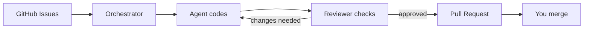
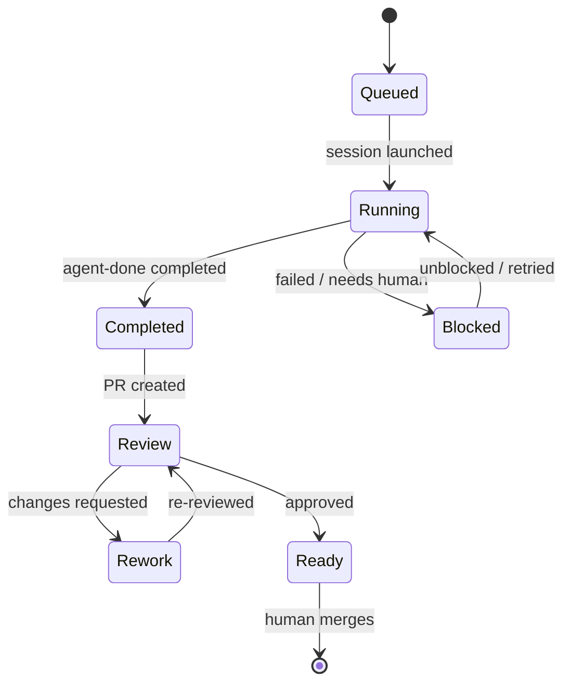

# Issue-Orchestrator

Issue-Orchestrator takes GitHub issues, runs AI agents on them with guardrails, and produces pull requests for you to merge.

AI agents are excellent at executing bounded tasks, but they optimize for completion, not long-term system health. Issue-Orchestrator provides the structure: enforced validation, automated code review, architecture boundary checks, and isolated worktrees — so agents can work in parallel while you stay in control.

## How it works

The orchestrator picks up GitHub issues, assigns them to AI agents, and manages the full lifecycle through to a merge-ready PR.



**Under the hood**, each tick of the orchestrator runs an observe-plan-apply loop: read GitHub state, decide what actions to take, execute them.

The agent-reviewer loop is the core of quality enforcement. When an agent finishes coding, a reviewer agent checks the work. If changes are needed, the coder fixes and the reviewer re-checks — with cycle limits to prevent infinite loops. The orchestrator mediates, and only creates a PR once code is approved. (The loop [can also run via a draft PR](docs/development/REVIEW_WORKFLOW.md) on GitHub.)

### Issue lifecycle

Every issue moves through a state machine. Labels on GitHub are the source of truth — if the orchestrator crashes, it recovers state from labels on restart.



## Dashboard

<!-- TODO: Add dashboard screenshot -->
*Screenshot placeholder — the web dashboard shows a kanban board with issues flowing through Queued, Running, Blocked, and Done columns.*

The dashboard gives you a live view of what the orchestrator is doing:

- **Queued** — issues waiting for an available agent slot
- **Running** — active agent sessions with live status
- **Blocked** — failed sessions, validation errors, or issues needing human input
- **Done** — completed PRs waiting for your review and merge

The dashboard also provides session timelines, failure analysis (why did this agent fail?), and E2E test results. Any client can connect: browser, VS Code ([MCP integration](docs/user/vscode.md)), or AI agents via the REST API.

## Guardrails

Agents cannot merge PRs — only humans merge. Validation (tests, linting, architecture checks) runs automatically before any code is pushed. [Multi-layer hooks](docs/architecture/hooks.md) enforce these rules at the AI agent level, git level, and server level — agents cannot bypass them. See [Guardrails & Safety Model](docs/design/guardrails.md) for details.

## Quickstart

```bash
make venv                              # creates .venv with uv + correct Python
export ISSUE_ORCH_GITHUB_TOKEN=ghp_...
issue-orchestrator setup
issue-orchestrator start
```

See [Installation](docs/user/installation.md) and [Quickstart Guide](docs/user/quickstart.md) for detailed setup, prerequisites, and configuration.

## More

**Async E2E Test Runner** — Background test execution with progress tracking, resumable runs, flake detection, quarantine support, and signal scoring. Survives orchestrator restarts. See [E2E documentation](docs/user/e2e.md).

**Goal Pilot** *(experimental, opt-in)* — An agentic layer that takes high-level goals and breaks them into orchestrator actions. Constrained by the same safety guarantees as the core. See [user guide](docs/user/goal_pilot.md) and [design document](docs/design/goal-pilot.md).

## Who it's for

- Solo builders and small teams using coding agents on real repos
- People who want strong safety and guardrails (humans merge, verification, reconciliation)

## Project Status

This project is under **active development**. Core orchestration, guardrails, and workflow enforcement are stable. APIs and internals may change as the system is refined.

The repository is public to support discussion, review, and hiring conversations.
For guidance on where to focus, see [REVIEWER_README.md](REVIEWER_README.md).

## Documentation

- **Getting started:** [Installation](docs/user/installation.md) · [Quickstart](docs/user/quickstart.md) · [Configuration](docs/user/configuration.md) · [GitHub Permissions](docs/user/github-permissions.md)
- **Architecture:** [Overview](docs/architecture/README.md) · [ADRs](docs/architecture/ADR/README.md) · [Guardrails](docs/design/guardrails.md) · [Hooks](docs/architecture/hooks.md)
- **Development:** [Testing](docs/development/TESTING.md) · [Troubleshooting](docs/development/TROUBLESHOOTING.md) · [Review Workflow](docs/development/REVIEW_WORKFLOW.md)
- **Reference:** [Configuration Reference](docs/user/configuration_reference.md) · [E2E Runner](docs/user/e2e.md) · [Goal Pilot](docs/user/goal_pilot.md)
