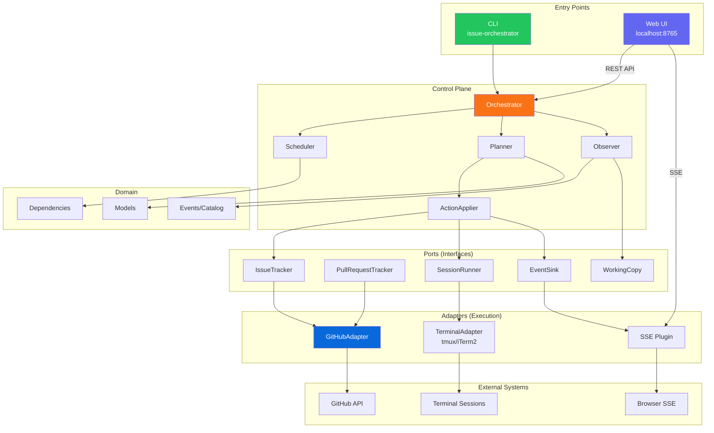

# Architecture

This document describes the architectural principles and directory structure of the issue-orchestrator.

## Core Principle

**Components that observe are Observers; components that decide are Controllers; components that act are Adapters.**

This separation creates clear responsibility boundaries:

| Layer | Responsibility | Authority |
|-------|----------------|-----------|
| **Observation** | Gather facts about current state | None - just reports |
| **Control** | Make decisions, advance state | Full authority |
| **Execution** | Perform actions on external systems | None - just executes |

## Directory Structure

```
src/issue_orchestrator/
├── control/              # Authority/decision layer
│   ├── scheduler.py      # Decides which issues to work on
│   └── (lifecycle.py)    # Future: LifecycleController
│
├── observation/          # Fact-gathering layer
│   └── observer.py       # SessionObserver - observes session state
│
├── execution/            # Action layer (adapters)
│   ├── github_adapter.py # Talks to GitHub API
│   ├── terminal_tmux.py  # Controls tmux sessions
│   ├── terminal_iterm.py # Controls iTerm2 sessions
│   ├── json_store.py     # Persists session data
│   └── manager.py        # Plugin manager
│
├── ports/                # Interfaces (protocols)
│   ├── issue_tracker.py     # IssueTracker protocol
│   ├── pull_request_tracker.py  # PullRequestTracker protocol
│   ├── label_set.py         # LabelSet protocol
│   ├── working_copy.py      # WorkingCopy protocol (local git)
│   └── session_store.py     # SessionStore protocol
│
├── domain/               # Domain models and state machines
│   ├── events.py         # Domain events
│   └── state_machines/   # State machine implementations
│
└── orchestrator.py       # Main facade (delegates to control/)
```

## Control Plane vs Execution Plane

### Control Plane (Authority)
- Lives in `control/` and `orchestrator.py`
- Makes policy decisions
- Advances state machines
- Determines what actions to take
- Does NOT directly call external systems

### Execution Plane (Mechanics)
- Lives in `execution/`
- Talks to external systems
- Returns facts/results
- Does NOT make policy decisions
- Just does what it's told

### Observation Layer (Facts)
- Lives in `observation/`
- Gathers facts about current state
- Reports what IS, not what SHOULD BE
- Does NOT make policy decisions
- Does NOT mutate state

## Naming Conventions

### Interfaces (Ports)
- **IssueTracker** - not "IssueRepository" (implies external system, not storage)
- **PullRequestTracker** - not "PRRepository"
- **LabelSet** - not "LabelManager" (avoids policy implication)
- **WorkingCopy** - not "GitRepository" (neutral, SCM-agnostic)

### Classes
- **SessionObserver** - not "SessionMonitor" (observers observe, don't control)
- **Scheduler** - makes scheduling decisions (control plane)
- **GitHubAdapter** - implements platform protocols (execution plane)

## The CompletionRecord Pattern

When an agent completes work, it writes a `CompletionRecord` to JSON:

```python
@dataclass
class CompletionRecord:
    session_id: str           # Orchestrator's session identifier
    outcome: CompletionOutcome  # What happened (COMPLETED, BLOCKED, etc.)
    requested_actions: list[RequestedAction]  # What agent wants
    # ... status-specific fields
```

Key principle: **The agent reports intent; the orchestrator decides and executes.**

1. Agent writes JSON completion record (observation)
2. Orchestrator reads and validates (untrusted input!)
3. Orchestrator decides what to do (control)
4. Orchestrator executes via adapters (execution)

## Hexagonal Architecture

The system follows hexagonal (ports and adapters) architecture:



### ASCII Overview

```
                    ┌─────────────────────┐
                    │                     │
    ┌───────────────┤   Control Plane     ├───────────────┐
    │               │   (Orchestrator)    │               │
    │               │                     │               │
    │               └──────────┬──────────┘               │
    │                          │                          │
    ▼                          ▼                          ▼
┌───────┐               ┌─────────────┐              ┌────────┐
│ Ports │◄──────────────┤   Domain    ├──────────────► Ports │
│(Input)│               │  (Models,   │               │(Output)│
└───┬───┘               │   Events)   │               └───┬────┘
    │                   └─────────────┘                   │
    ▼                                                     ▼
┌───────────┐                                       ┌───────────┐
│ Adapters  │                                       │ Adapters  │
│(Execution)│                                       │(Execution)│
└───────────┘                                       └───────────┘
    │                                                     │
    ▼                                                     ▼
┌───────────┐                                       ┌───────────┐
│  GitHub   │                                       │  Terminal │
│   API     │                                       │  (tmux)   │
└───────────┘                                       └───────────┘
```

## Dependency Injection

The orchestrator uses constructor-based dependency injection:

```python
@dataclass
class Orchestrator:
    config: Config
    events: EventSink = field(default_factory=NullEventSink)
    runner: SessionRunner = field(default_factory=NullSessionRunner)
    _github_adapter: Optional[GitHubAdapter] = field(default=None)
```

### Key Ports

| Port | Purpose | Production Adapter |
|------|---------|-------------------|
| `EventSink` | Fire-and-forget trace events | `PluggyEventSink` |
| `SessionRunner` | Terminal session management | `PluggySessionRunner` |
| `IssueTracker` | Issue operations | `GitHubAdapter` |
| `SessionStore` | Persist session state | `JsonSessionStore` |

### Composition Root

`bootstrap.py` is the **only place** that wires dependencies:

```python
def build_orchestrator(config: Config) -> Orchestrator:
    pm = create_plugin_manager(...)  # Pluggy stays here
    events = PluggyEventSink(pm)
    runner = PluggySessionRunner(pm)
    github = GitHubAdapter(config.repo)
    return Orchestrator(config=config, events=events, runner=runner, _github_adapter=github)
```

### Why This Matters

- **Core has no pluggy imports** - orchestrator.py only knows about Protocols
- **Testable** - inject MockEventSink, MockSessionRunner in tests
- **Extensible** - swap adapters without touching core logic

## Testing

The architecture enables clean testing:

1. **Unit tests** - Mock ports, test control logic in isolation
2. **Integration tests** - Use real adapters, verify wiring
3. **Contract tests** - Verify adapters implement protocols correctly

### Test Fixtures

```python
# conftest.py provides auto-patching
@pytest.fixture(autouse=True)
def patch_orchestrator_dependencies(monkeypatch):
    """Injects MockEventSink and MockSessionRunner into all Orchestrator instances."""
    # Patches __post_init__ to inject mocks
```

Example:
```python
# Control plane test - mock the port
def test_scheduler_prioritizes_by_milestone():
    mock_tracker = MockIssueTracker()
    mock_tracker.issues = [...]

    scheduler = Scheduler(config)
    result = scheduler.get_next_issues(mock_tracker)

    assert result[0].number == 42  # Highest priority
```

## Backwards Compatibility

To minimize churn, backwards compatibility modules exist:

- `issue_orchestrator.observer` → re-exports from `observation/`
- `issue_orchestrator.scheduler` → re-exports from `control/`
- `issue_orchestrator.adapters` → re-exports from `execution/`

New code should import from the canonical locations.

## Control Plane Modules

The control plane (`control/`) contains several specialized modules:

### TransitionGuard

Centralizes state machine transition handling with "fail loud but caught" semantics:

```python
guard = TransitionGuard(events=event_sink)
result = guard.try_trigger(issue_machine, "claim", entity_type="issue", entity_id=123)
if not result.applied:
    logger.warning(f"Invalid transition: {result.error}")
```

- Wraps state machine triggers
- Emits `transition.applied` and `transition.rejected` trace events
- Returns typed `TransitionResult` instead of raising exceptions

### SessionManager

Owns terminal session lifecycle and naming conventions:

```python
manager = SessionManager(runner=session_runner, events=event_sink, config=config)
ctx = issue_session_context(issue_number=123, command="claude", working_dir=path)
manager.start(ctx)
```

- `SessionRef`: Type-safe session reference (issue/review/rework/triage)
- `SessionContext`: Launch parameters for sessions
- Delegates to `SessionRunner` port for actual terminal operations

### LabelProjection + LabelSync

Separates label POLICY from label MECHANICS:

```python
# LabelProjection: Pure logic - state → desired labels
projection = LabelProjection(config)
desired = projection.for_issue_state(IssueState.IN_PROGRESS)

# LabelSync: IO - applies label changes idempotently
sync = LabelSync(labels=label_set, events=event_sink)
result = sync.sync(issue_number=123, current=current_labels, desired=desired)
```

- `LabelProjection`: Single source of truth for label policy
- `DesiredLabels`: Immutable representation of intended label state
- `LabelSync`: Idempotent label synchronization via `LabelSet` port

### Workflows

Encapsulate domain-specific decision logic:

```python
# ReviewWorkflow: Code review lifecycle
workflow = ReviewWorkflow(config=config, events=event_sink)
decision = workflow.should_launch_reviews(pending_reviews, active_count, paused)
if decision.should_launch:
    for review in decision.reviews_to_launch:
        # Launch review session

# ReworkWorkflow: Rework cycle management
decision = rework_workflow.should_escalate(rework_cycle=3)
if decision.should_escalate:
    # Add needs-human label

# TriageWorkflow: Failure investigation
decision = triage_workflow.should_trigger_batch_triage(failure_count=5)
```

Each workflow:
- Contains POLICY (what should happen), not MECHANICS
- Returns Decision objects describing intended actions
- Can be unit tested with fake ports

### Actions + ActionApplier

The Plan/Apply boundary for orchestrator operations:

```python
# Actions describe WHAT should happen (the plan)
actions = [
    AddLabelAction(issue_number=123, label="in-progress"),
    LaunchSessionAction(session_type="issue", number=123, command="claude", ...),
]

# ActionApplier handles HOW (execution via ports)
applier = ActionApplier(labels=label_set, sessions=session_manager, events=event_sink)
results = applier.apply_all(actions)
```

This separation enables:
- Planning code tested without IO (pure logic)
- Applier tested with fake ports
- Clear audit trail via trace events

## Control Plane Structure

```
control/
├── __init__.py              # Public exports
├── scheduler.py             # Issue prioritization
├── completion_processor.py  # Handle agent completion records
├── transition_guard.py      # State machine transition wrapper
├── session_manager.py       # Terminal session lifecycle
├── label_projection.py      # State → labels policy
├── label_sync.py            # Label synchronization IO
├── actions.py               # Action dataclasses
├── action_applier.py        # Execute actions via ports
└── workflows/
    ├── __init__.py
    ├── review_workflow.py   # Code review decisions
    ├── rework_workflow.py   # Rework cycle decisions
    └── triage_workflow.py   # Triage decisions
```

## Observability Pattern

**Events are the source of truth for observability. Never use `print()` or direct `logger` calls in business logic.**

### Why Events Over Logging

Direct logging couples presentation to logic:
```python
# BAD - presentation mixed with business logic
logger.info(f"Processing completion for #{issue_number}")
print(f"  PR created: {pr_url}")
```

Events decouple observation from consumption:
```python
# GOOD - emit structured event, let consumers decide presentation
self.events.publish(TraceEvent("completion.succeeded", {
    "issue_number": issue_number,
    "pr_url": pr_url,
    "actions_taken": actions_taken,
}))
```

### Benefits

| Concern | Events | Direct Logging |
|---------|--------|----------------|
| **Testability** | Assert event emitted | Parse log strings |
| **Multi-consumer** | IPC, dashboard, audit, metrics | Log file only |
| **Structure** | Typed data dict | Unstructured string |
| **Decoupling** | Core doesn't know about logging | Tight coupling |

### Event Consumers (Pluggy Plugins)

The `EventSink` port receives `TraceEvent` and can have multiple implementations:

- **LoggingPlugin** - writes events to log files
- **IPCPlugin** - broadcasts to dashboard/CLI via Unix socket
- **SSEPlugin** - pushes to web dashboard via Server-Sent Events
- **AuditPlugin** - persists to audit trail
- **MetricsPlugin** - updates counters/timers

### Event Naming Convention

Use hierarchical names with `.` separator:
```
completion.processing    # Starting to process completion
completion.succeeded     # Completion processing succeeded
completion.failed        # Completion processing failed
completion.missing       # No completion.json found

session.started         # Agent session started
session.completed       # Agent session completed
session.failed          # Agent session failed

transition.applied      # State machine transition succeeded
transition.rejected     # State machine transition rejected
```

### Implementation

```python
# In orchestrator code - emit events
self.events.publish(TraceEvent("completion.succeeded", {
    "issue_number": issue_number,
    "outcome": outcome,
    "pr_url": pr_url,
}))

# In plugin - consume events
class LoggingPlugin:
    @hookimpl
    def on_trace_event(self, event: TraceEvent):
        logger.info("[%s] %s", event.name, event.data)
```

### Rule

**If you need to observe something, emit an event. If you need to log, subscribe to events.**
