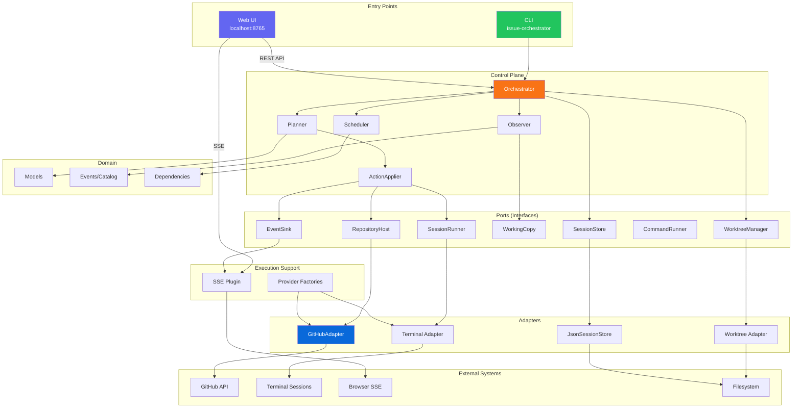

# Architecture

For engineering conventions, dependency-injection rules, event vs log guidance, and package-level boundaries, see [AGENTS.md](../../AGENTS.md). Directory-specific `AGENTS.md` files under `src/` and `tests/` refine those rules for each area.

This page is about how the Issue-Orchestrator codebase is organized internally. For the distinction between the product thesis and this repo's implementation architecture, see [Issue-Orchestrator Internal Architecture](internal-architecture.md).

## System Overview

## Further Reading

- [ADRs](ADR/README.md) — Architectural Decision Records
- [Internal Architecture](internal-architecture.md) — How this repo is built and enforced
- [Hook Enforcement](hooks.md) — Multi-layer guardrail system
- [Review Workflow](../development/REVIEW_WORKFLOW.md) — Code review, rework cycles, exchange mechanisms
- [Guardrails & Safety](../design/guardrails.md) — Safety model and trust boundaries
