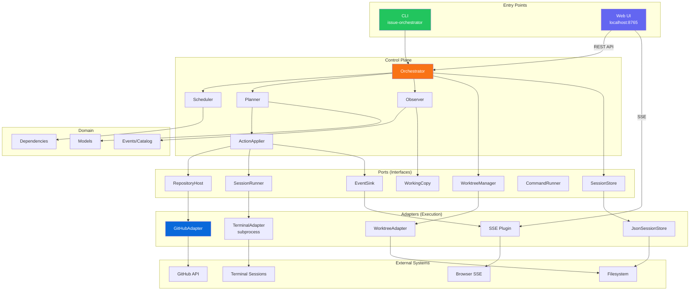

# Architecture

For architecture principles, coding conventions, dependency injection patterns, event vs logging rules, testing philosophy, and port/adapter guidelines, see [CLAUDE.md](../../CLAUDE.md). That file is the single source of truth for how to work in this codebase — it's written for AI agents but applies equally to human developers.

## System Overview

## Further Reading

- [ADRs](ADR/README.md) — Architectural Decision Records
- [Hook Enforcement](hooks.md) — Multi-layer guardrail system
- [Review Workflow](../development/REVIEW_WORKFLOW.md) — Code review, rework cycles, exchange mechanisms
- [Guardrails & Safety](../design/guardrails.md) — Safety model and trust boundaries
