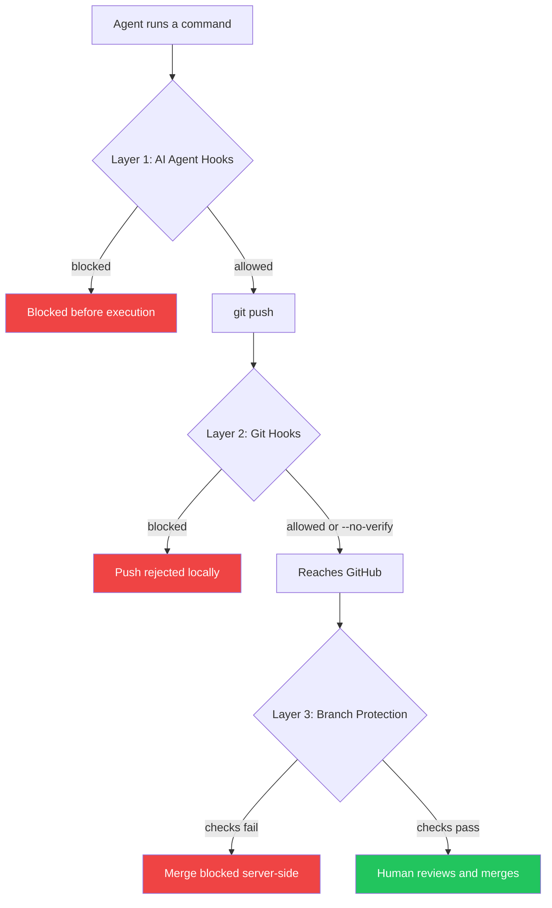

# Hook Enforcement Architecture

This document describes the multi-layer hook system that ensures agents cannot bypass safety guardrails.

> **AI Agents:** The `hooks` skill (`.claude/skills/hooks/SKILL.md`) is auto-invoked when working on hook-related files. See also `hooks/AGENTS.md` for local git hook templates.

## Why Hooks Matter

Policy documents (`AGENTS.md`, prompts, checklists) are suggestions. Agents can forget, ignore, or creatively work around them. Hooks are **enforcement** - technical barriers that block unsafe actions before they execute.

Without hooks, agents will find ways around conventions and the system breaks.

## Hook Layers

Defense-in-depth: each layer catches what the previous one misses.



| Layer | Mechanism | Bypassable? |
|-------|-----------|-------------|
| **1. AI Agent** | Claude `PreToolUse`, Cursor `beforeShellExecution`, Copilot `--deny-tool`, Codex `Execpolicy` | Not by the agent |
| **2. Git Hooks** | Pre-push wrapper chains project + orchestrator hooks, audit trail | `--no-verify` (but Layer 1 blocks that) |
| **3. Server-Side** | GitHub branch protection, required status checks | Cannot be bypassed |

## Hook Inventory

### Repo Guardrails (local development)

These are repo-local hooks installed by `issue-orchestrator setup-guardrails`.
Control Center uses the same guardrail setup flow when Doctor reports repairable
repo-guardrail drift, so users can repair managed files from the Doctor modal
instead of switching to a terminal.

| Hook | Type | Location | Purpose |
|------|------|----------|---------|
| Pre-push | Git | `.githooks/pre-push` (or your configured `core.hooksPath`) | Runs the repo's canonical `scripts/verify-pr.sh` gate before push |
| PR gate | Script | `scripts/verify-pr.sh` | Runs the repo's publish validation command from `validation.publish.cmd` |
| Hook helper | Python | `scripts/agent-hooks/block_no_verify.py` | Repo-local fallback used by agent hook scripts |

### Orchestrator-Installed Hooks (per worktree)

These are installed automatically by issue-orchestrator when creating worktrees.

| Hook | Type | Location | Purpose |
|------|------|----------|---------|
| Pre-push wrapper | Git | `.git/hooks/pre-push` | Chains project + orchestrator hooks, writes audit trail |
| Pre-push (orchestrator) | Git | `.git/hooks/pre-push.orchestrator` | Validates Agent-Status trailers and enforces the configured publish dirty-tree policy |
| Stop hook | Claude Code | `.claude/settings.json` | Warns if session exits without `coding-done`/`reviewer-done` |
| gh wrapper | PATH script | `scripts/gh` | Blocks `gh pr create` without auth token |

### Target Project Hooks (project-specific)

These are installed and refreshed in the target project by `issue-orchestrator setup-guardrails`. `setup-hooks` still exists as the hook-only command when you intentionally are not managing repo-local pre-push guardrails yet.

| Hook | Type | Location | Purpose | Critical? |
|------|------|----------|---------|-----------|
| PreToolUse (Claude) | Claude Code | `.claude/hooks/block-no-verify.sh` | Blocks `git push --no-verify` at AI level | **YES** |
| beforeShellExecution (Cursor) | Cursor | `.cursor/hooks.json` | Blocks `git push --no-verify` at AI level | **YES** |
| Pre-push | Git | `.githooks/pre-push` | Runs project tests/linters before push | **YES** |
| Execpolicy rules (Codex) | Codex CLI | `.codex/rules/orchestrator.rules` | Blocks dangerous commands outside sandbox | **YES** |
| AGENTS.md / CLAUDE.md | Policy | `AGENTS.md` (`CLAUDE.md` symlink for compatibility) | Documents prohibited actions | Advisory |

Managed pre-push guardrails also support an optional
`repo-specific/hooks/post-verify` extension point. When that hook exists during
`setup-guardrails` or guardrail repair, the rendered wrapper runs it after
`scripts/verify-pr.sh` succeeds and before the push is allowed. The hook receives
the normal pre-push remote arguments (`remote-name` and `remote-url`), but not
the refs stdin stream because the verify step may already consume it. Re-run
guardrail setup or repair after adding the hook so the managed wrapper includes
the dispatch.

## AI Agent Support Matrix

| AI Agent | Hook Mechanism | Can Block `--no-verify` | Supported |
|------------|----------------|------------------------|-----------|
| Claude Code | `PreToolUse` in `.claude/settings.json` | ✅ Yes (exit 2) | ✅ |
| Cursor (1.7+) | `beforeShellExecution` in `.cursor/hooks.json` | ✅ Yes (`"permission": "deny"`) | ✅ |
| GitHub Copilot CLI | `--deny-tool` flags | ✅ Yes (glob patterns) | ✅ |
| OpenAI Codex CLI | `Execpolicy` rules | ✅ Yes | ✅ |
| Gemini CLI | In development | ⚠️ Not yet | ❌ |
| Aider | None (lint only) | ❌ No | ❌ |

**Unsupported AI agents cannot be used** - without hook enforcement, safety guarantees don't hold.

## What Each Hook Blocks

### PreToolUse / beforeShellExecution (AI Level)

Intercepts commands before the AI can execute them:

```bash
# BLOCKED - exit 2 prevents execution
git push --no-verify
git commit --no-verify -m "message"
git -c core.hooksPath=/dev/null push
git config --local core.hooksPath /dev/null
gh pr merge 123                          # Agents cannot merge PRs
gh pr merge 123 --squash
gh api repos/owner/repo/pulls/123/merge  # API merge also blocked

# ALLOWED - passes through
git push
git commit -m "message"
gh pr create --title "..."               # Creating PRs is fine
gh pr view 123                           # Viewing PRs is fine
```

### Pre-push Wrapper (Git Level)

Runs when `git push` is invoked (unless `--no-verify` bypasses it):

```bash
#!/bin/bash
# Audit trail - proves wrapper executed
echo "$(date -Iseconds) wrapper-started" >> .git/hooks/pre-push.log

# Run project hook first (their tests/linters)
./pre-push.project "$@"
PROJECT_EXIT=$?
echo "$(date -Iseconds) project-hook exit=$PROJECT_EXIT" >> .git/hooks/pre-push.log

# Run orchestrator hook (trailer validation)
./pre-push.orchestrator "$@"
ORCH_EXIT=$?
echo "$(date -Iseconds) orchestrator-hook exit=$ORCH_EXIT" >> .git/hooks/pre-push.log

# Exit with appropriate code
if [ $PROJECT_EXIT -ne 0 ]; then exit $PROJECT_EXIT; fi
if [ $ORCH_EXIT -ne 0 ]; then exit $ORCH_EXIT; fi
exit 0
```

### Pre-push Orchestrator Hook

Validates agent completion:

- Checks for `Agent-Status:` trailer in latest commit
- Validates required fields based on status
- Blocks test-skipping patterns (`@Disabled`, `@Ignore`, `assumeTrue`)

### gh Wrapper

Blocks unauthorized GitHub CLI operations:

```bash
# BLOCKED - no auth token
gh pr create --title "..." --body "..."

# ALLOWED - completion command sets ORCHESTRATOR_GH_AUTH
ORCHESTRATOR_GH_AUTH=agent-done-authorized gh pr create ...
```

## Verification Flow

Verification proves hooks are not just installed but **effective**.

### Running Verify

```bash
$ issue-orchestrator verify

[1/5] Creating test branch...
      verify-test-1703019876 ✅

[2/5] Making idempotent change...
      echo "verify-1703019876" >> .verify-canary
      git commit -m "chore: verify hooks" ✅

[3/5] Testing PreToolUse (--no-verify must be blocked)...
      Attempting: git push --no-verify origin verify-test-xxx
      → Exit 2: BLOCKED ✅

[4/5] Testing pre-push hook fires...
      git push origin verify-test-xxx
      Checking audit trail: .git/hooks/pre-push.log
      → wrapper-started ✅
      → project-hook exit=0 ✅
      → orchestrator-hook exit=0 ✅

[5/5] Cleanup...
      git branch -D verify-test-xxx ✅
      git push origin --delete verify-test-xxx ✅ (if pushed)

✅ VERIFIED - Guardrails effective
   Wrote: .issue-orchestrator-verified
```

## Hook Verification By Agent

Verification is split into two phases:

- Install/verify (always required): ensure hooks/rules are installed and behaviorally block `--no-verify`.
- AI gate test (interval-based): spawn the agent where supported and confirm the end-to-end block works.

If an agent is configured in YAML, missing its CLI or hook wiring is a **failure**, not a skip.

| Agent | Install/verify (required) | AI gate test (interval) |
| --- | --- | --- |
| Claude Code | `.claude/hooks` + `.claude/settings.json` + script tests | ✅ Supported (spawns Claude) |
| Gemini | `.gemini/hooks` + `.gemini/settings.json` + script tests | ✅ Supported (spawns Gemini) |
| Cursor | `.cursor/hooks` + `.cursor/hooks.json` + script tests | ✅ Supported (spawns Cursor Agent) |
| Copilot | `.github/hooks` + `.github/hooks.json` + script tests | ✅ Supported (spawns Copilot CLI) |
| Codex CLI | `.codex/rules/orchestrator.rules` + `codex execpolicy check` | ❌ Not supported |

### Hook Validation Config

To exercise AI gate tests for all supported CLIs without changing your main config, use:

```bash
make verify-hooks-all
```

This runs `issue-orchestrator setup-hooks` with `.issue-orchestrator/config/hooks-validate.yaml`,
which installs hooks and executes AI gate tests for the configured agents.
Codex is intentionally excluded because AI gate tests are not yet supported.

### Verification Marker

The marker file proves verification ran and passed:

```yaml
# .issue-orchestrator-verified
verified_at: 2024-12-19T10:30:00Z
verified_by: issue-orchestrator v1.2.3
meta_agent: claude-code
hooks_hash: sha256:abc123def456...
signature: sha256(verified_at + hooks_hash + secret)
```

- `hooks_hash`: Hash of all hook files - triggers re-verify if hooks change
- `signature`: Tamper-proof - can't just `touch` the file to skip verify

### Startup Behavior

| Marker State | Behavior |
|--------------|----------|
| Missing | Auto-run verify, block if fails |
| Valid | ✅ Start normally |
| Stale (hooks changed) | Auto-run verify |
| Invalid signature | Auto-run verify |

## Configuration

```yaml
# .issue-orchestrator/config/default.yaml

# Verification config (optional)
verify:
  test_file: ".verify-canary"  # File to modify during verify

# Dangerous overrides (NOT RECOMMENDED)
dangerous:
  allow_unsupported_agents: true  # Allow AI agents without hooks
```

## Setup Flow

```bash
$ issue-orchestrator setup

[1/4] Which AI agent are you using?
      > Claude Code
      > Cursor
      > Copilot CLI
      > Codex CLI

[2/4] Installing AI-level hook (blocks --no-verify)...

      For Claude Code:
        Created: .claude/hooks/block-no-verify.sh
        Updated: .claude/settings.json

      For Cursor:
        Created: .cursor/hooks/block-no-verify.js
        Updated: .cursor/hooks.json

[3/4] Installing pre-push wrapper...
      Existing hook found: .githooks/pre-push
      Backed up to: .githooks/pre-push.project
      Created wrapper: .githooks/pre-push (chains both hooks)

[4/4] Running verification...
      <full verify flow>

✅ Setup complete - guardrails verified
```

## Hook File Templates

### Claude Code: block-no-verify.sh

```bash
#!/bin/bash
# Block dangerous commands for Claude Code agents
# Exit 2 = BLOCK, Exit 0 = ALLOW

input=$(cat)

python_bin="$(command -v python3 || true)"
if [[ -z "$python_bin" ]]; then
  echo "BLOCKED: python3 is required for orchestrator hooks." >&2
  exit 2
fi

hook_dir="$(cd "$(dirname "${BASH_SOURCE[0]}")" && pwd)"
command=$("$python_bin" "$hook_dir/parse_hook_input.py" <<< "$input" 2>/dev/null || echo "")

# Block --no-verify bypass attempts
if echo "$command" | grep -qE "git\s+(commit|push).*--no-verify"; then
  echo "BLOCKED: --no-verify is forbidden. Pre-commit hooks must run." >&2
  exit 2
fi

# Block gh pr merge - agents cannot merge PRs
if echo "$command" | grep -qE "gh\s+pr\s+merge"; then
  echo "BLOCKED: Agents cannot merge PRs. Only humans can merge." >&2
  exit 2
fi

# Block gh api merge endpoint
if echo "$command" | grep -qE "gh\s+api\s+.*pulls/[0-9]+/merge"; then
  echo "BLOCKED: Agents cannot merge PRs via API." >&2
  exit 2
fi

exit 0
```

### Claude Code: settings.json addition

```json
{
  "hooks": {
    "PreToolUse": [
      {
        "matcher": "Bash",
        "hooks": [
          {
            "type": "command",
            "command": ".claude/hooks/block-no-verify.sh"
          }
        ]
      }
    ]
  }
}
```

### Cursor: hooks.json

```json
{
  "beforeShellExecution": [
    {
      "command": ".cursor/hooks/block-no-verify.sh",
      "output": "json"
    }
  ]
}
```

Cursor hooks return JSON: `{"permission": "deny", "userMessage": "..."}`

## Audit Trail

The pre-push wrapper writes to `.git/hooks/pre-push.log`:

```
2024-12-19T10:30:00+00:00 wrapper-started
2024-12-19T10:30:05+00:00 project-hook exit=0
2024-12-19T10:30:05+00:00 orchestrator-hook exit=0
```

This proves:
- Git invoked the hook mechanism
- Both project and orchestrator hooks executed
- Exit codes for debugging failures

## Troubleshooting

### "Verification failed: --no-verify was not blocked"

The AI-level hook is missing or misconfigured:

1. Check hook file exists and is executable
2. Check settings.json/hooks.json references it correctly
3. Check the hook script actually exits with code 2 for blocked commands

### "Pre-push hook did not execute"

The git hooks path is misconfigured:

1. Check `git config core.hooksPath` points to correct directory
2. Check hook file is executable: `chmod +x .githooks/pre-push`
3. Check hook file has correct shebang: `#!/bin/bash`

### "Verification marker invalid"

The marker file was tampered with or hooks changed:

1. Re-run `issue-orchestrator verify`
2. If hooks were legitimately updated, this is expected

### Agent bypassed hooks anyway

Check which layer failed:

1. AI-level hook logs (if any)
2. `.git/hooks/pre-push.log` audit trail
3. GitHub PR - was it created through the completion command?

If all hooks were in place, file a bug report with the bypass method.
