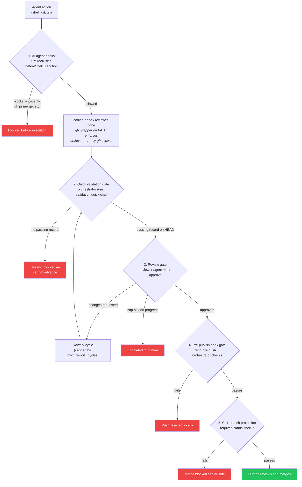

# Guardrails & Safety Model

Issue-Orchestrator is designed to assist humans, not replace trust boundaries. Agents are powerful but constrained by explicit guardrails at multiple layers. This document is the unified reference; it links out to the detailed subsystem docs for each mechanism.

## What the system guarantees

- **Agents cannot publish code directly.** All publishing is gated by a mandatory validation step and enforced by the orchestrator and CI.
- **Humans always merge.** Branch protection is assumed; agents may create draft PRs but never merge.
- **A passing review is required before code is published.** The orchestrator runs a reviewer agent against every completion and gates publishing on approval.
- **Agents do not hold GitHub credentials.** The `gh` CLI is shadowed by a wrapper that rejects PR-creating and PR-merging commands unless the orchestrator injects an authorization token.
- **Architecture boundaries are enforced.** Control, domain, and ports layers cannot perform side effects (subprocesses, HTTP calls). Violations fail fast.
- **Validation is lifecycle-scoped.** The quick gate gives agents fast feedback while they still own the worktree; the publish gate is the authoritative local branch-readiness policy before push.

## The guardrail pipeline

Every attempt to move code from an agent to the protected branch flows through the same pipeline. Each stage is independent: bypassing one does not defeat the next.

Static guardrails (import-linter + custom AST checks) run inside stages 2 and 4 to prevent architectural drift. Agent credential scoping is covered by [ADR-0005: human-merge and agent-credential isolation](../architecture/ADR/0005-human-merge-and-agent-credential-isolation.md); the mechanical enforcement rationale is [ADR-0012: mechanical guardrails](../architecture/ADR/0012-mechanical-guardrails.md).

## How each guardrail is enforced

Defense-in-depth: each layer catches what the previous one misses.

### 1. AI agent hooks — block `--no-verify` and direct merges

AI-level hooks (Claude Code `PreToolUse`, Cursor `beforeShellExecution`, Copilot `--deny-tool`, Codex `Execpolicy`) reject commands before the agent executes them. They block:

- `git push --no-verify` and `git commit --no-verify`
- Hook-path bypass variants (`git -c core.hooksPath=/dev/null push`, `git config --local core.hooksPath /dev/null`)
- `gh pr merge` and the equivalent `gh api ... /pulls/*/merge` — agents cannot merge PRs

Unsupported AI agents (no hook mechanism) are refused by `issue-orchestrator setup-guardrails` because without this layer the other guarantees weaken. See [Hook Enforcement Architecture](../architecture/hooks.md) for the support matrix and hook file templates.

### 2. Orchestrator quick validation gate

When an agent calls `coding-done completed`, the orchestrator runs the user-defined `validation.quick.cmd` (fast tests, lint, type-check, lightweight policy scans) and writes a validation record keyed by commit SHA to `.issue-orchestrator/validation/<suite>/<HEAD_SHA>.json`. Local coder/reviewer exchange also uses this quick record so reviewers get fast confidence without running the full publish suite on every back-and-forth.

This is the layer that catches obvious regressions while the coding agent can still fix them immediately. Repo-specific cheap policy checks, such as rejecting newly added test skips (`assumeTrue`, `assumeFalse`, `@Disabled`, `@Ignore`), should live inside the configured quick command. See [Validation System](../architecture/validation.md) for the record format and cache model.

### 3. Review-as-gate — required passing review before publish

Every completed coding session is handed to a reviewer agent before anything is published. The reviewer emits a `CompletionRecord` with `approved` or `changes_requested`; only `approved` unlocks the publish stages below. If the reviewer requests changes, the orchestrator launches a rework session and the loop repeats up to `max_rework_cycles` (default 5) before escalating to a human. `max_no_progress` stops the loop early when consecutive rounds yield no improvement.

The exchange can run via draft PR (`via-draft-pr`), an in-process local loop (`via-local-loop`, default), or MCP (`via-mcp`) — the gating rule is identical in all modes: no approval, no publish. See [Review Workflow](../development/REVIEW_WORKFLOW.md) for exchange mechanisms and cycle-limit details.

### 4. Pre-publish hook gate

Before the orchestrator performs the authenticated push, it runs the worktree's effective `.git/hooks/pre-push` wrapper itself. That wrapper chains the project's pre-push hook (`make validate-pr`, `scripts/verify-pr.sh`, etc.) with the orchestrator's pre-push hook (Agent-Status trailer validation and the configured dirty-tree policy). This moves hook failures earlier in the lifecycle while preserving the exact same policy the real push would enforce.

The real push still keeps hooks enabled. The publish validation command is `validation.publish.cmd`, and its cache-bearing record is keyed by commit SHA plus command, so the later hook pass can reuse the same passing token instead of rerunning the expensive validation command on the same commit. Agents still cannot use `--no-verify` themselves; Layer 1 blocks that.

For managed target repos, `setup-guardrails` also records the selected config
filename into `scripts/verify-pr.sh`. If the repo later switches to another
config file, rerun `setup-guardrails` so the pre-push gate and cache token keep
using the same validation contract.

### 5. CI and branch protection

Required status checks in GitHub branch protection re-run the canonical validation gate in a clean environment, mirroring `make validate-pr` across a fast job and an agent-backed job. This is the ultimate backstop: even if every local layer were bypassed, unverified code cannot land on the protected branch. Humans still perform the merge.

## Cross-cutting control: `gh` credential removal

Agent worktrees put a shadow `scripts/gh` on `PATH`. This wrapper rejects `gh pr create`, `gh pr merge`, and `gh api ... /pulls/*/merge` unless `ORCHESTRATOR_GH_AUTH` is present in the environment. Only the orchestrator's completion commands (`coding-done`, `reviewer-done`) set that variable, and only after the validation and review gates have passed. Read-only commands (`gh pr view`, `gh issue list`, etc.) are unaffected.

This is a cross-cutting control rather than a pipeline stage: it applies to any `gh` invocation the agent attempts throughout the session, not only at publish time. Combined with the AI-level block on `gh pr merge`, it means an agent who tries to create or merge a PR out-of-band gets a clean rejection at two independent layers.

## Install and verify

For a target repo, the intended install path is `issue-orchestrator setup-guardrails`: it installs the repo-local pre-push gate plus the configured AI-agent hook wiring in one step. Control Center uses the same flow when Doctor reports repairable repo-guardrail drift.

`issue-orchestrator verify` then exercises the hooks end-to-end — including spawning supported AI agents to confirm `--no-verify` is actually blocked — and writes a signed `.issue-orchestrator-verified` marker. Startup refuses to proceed when the marker is missing, stale, or has an invalid signature. See [Hook Enforcement Architecture](../architecture/hooks.md#verification-flow) for the full verification flow.

## What the system does not claim

- **Local process isolation**: Agent execution on macOS is not sandboxed. Agents can run arbitrary shell commands on the host. The guardrails prevent unvalidated code from being merged, not arbitrary local execution.
- **Absolute-path execution** (e.g. `/usr/bin/*`) cannot be fully prevented locally.
- For strong process isolation, container or CI-based execution is a future option.

This is an intentional trade-off. The system guarantees that agents cannot bypass validation or merge unreviewed code, but it does not claim to sandbox the agent's local environment.
