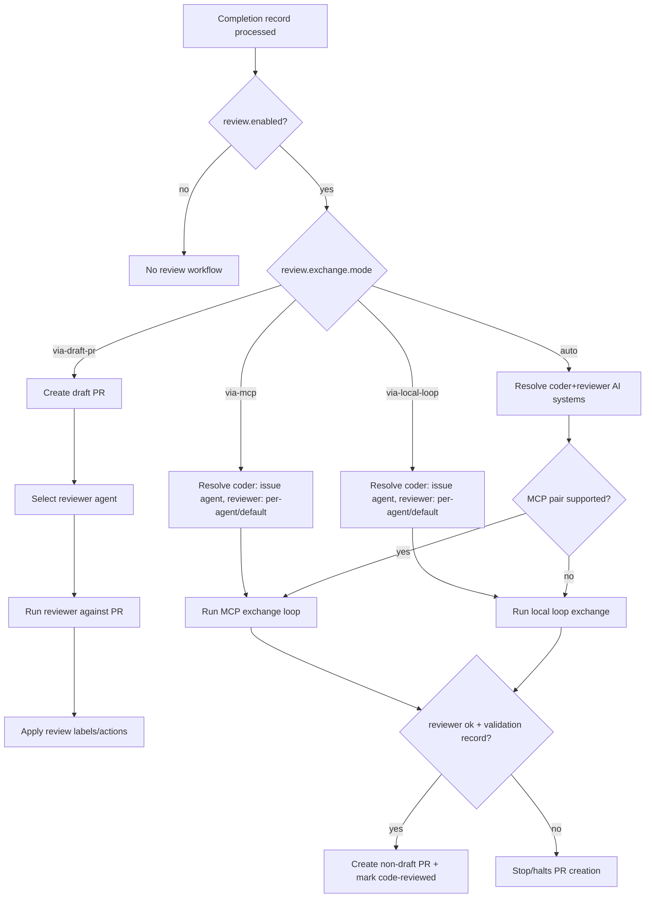

# Review Workflow

## Review Exchange Decision Flow



## Multi-Stage Review Pipeline

```
Work Agent creates PR
       |
[Stage 1: Code Review] (per-PR, immediate)
  - Triggered immediately by orchestrator
  - Also scanned at startup for crash recovery
  - Review agent checks code quality, tests
  - Uses: agent-done approved/changes_requested
  - Label: "needs-code-review" -> "code-reviewed" or "needs-rework"
       |
     /   \
Approved  Changes Requested
    |           |
    |     [Rework Loop] (automatic, up to max_rework_cycles)
    |       - Orchestrator detects "needs-rework" label
    |       - Re-queues work agent to fix issues
    |       - Tracks cycle via "rework-1", "rework-2" labels
    |       - After max cycles: escalates to "needs-human"
    |           |
    |     Back to Code Review
    |
Humans can optionally review on GitHub
       |
[Stage 2: Triage Batch Review] (batch, threshold-triggered)
  - Triggered when N code-reviewed PRs accumulate
  - Triage agent reviews patterns across PRs
  - Label: "code-reviewed" -> "triage-reviewed"
       |
Manual merge


[Failure Investigation Path]
Session FAILED/BLOCKED/TIMEOUT
       |
  - If triage_review_on_failure: true (default)
  - Triage agent investigates what went wrong
  - Uses _queue_triage_failure_review()
  - Helps identify patterns in failures
```

## Configuration

```yaml
review:
  # Stage 1: Code Review (per-PR)
  code_review_agent: "agent:reviewer"
  code_review_label: "needs-code-review"
  code_reviewed_label: "code-reviewed"

  # Rework iteration limit
  max_rework_cycles: 2  # Escalate to needs-human after N cycles

  # Stage 2: Triage Batch Review
  triage_review_agent: "agent:triage"
  triage_reviewed_label: "triage-reviewed"
  triage_review_threshold: 5  # Trigger after 5 PRs

  # Failure Investigation
  triage_review_on_failure: true  # Triage investigates failures (default: true)

labels:
  needs_rework: "needs-rework"
```

## Key Design Decisions

1. **Orchestrator manages workflow** - Agents are workers with simple jobs. Orchestrator triggers the right agent at the right time.

2. **Two trigger modes**:
   - **Immediate (in-memory)**: Work agent completes -> orchestrator queues code review
   - **Recovery (label-based)**: On startup, scans for PRs with `needs-code-review` label

3. **Labels as source of truth** - Crash-safe: labels persist, orchestrator picks up where it left off

## Review Decision Policy (Strict)

Review decision criteria are maintained in `.claude/skills/review-workflow/SKILL.md` (canonical source).
Use that section for nit vs non-nit examples and strict approve/request-changes rules.

## Orchestrator Methods

| Method | Purpose |
|--------|---------|
| `queue_code_review()` | Queue PR for review (called on work completion) |
| `launch_review_session()` | Launch review agent for a PR |
| `process_pending_reviews()` | Process queued reviews (each loop) |
| `scan_needs_rework_prs()` | Scan for PRs needing rework |
| `launch_rework_session()` | Launch work agent to fix issues |
| `check_triage_review_trigger()` | Check if triage should trigger |

## Cleanup Configuration

Control when AI session tabs close and worktrees are removed:

```yaml
cleanup:
  with_triage:                    # When triage review is enabled
    close_ai_session_tabs: true   # Close tabs after triage review
    remove_worktrees: false       # Keep worktrees for reference

  without_triage:                 # When triage review is NOT enabled
    wait_for_code_review: true    # true = after code review, false = on completion
    close_ai_session_tabs: true
    remove_worktrees: false
```

## UI Phase Detection

Dashboard shows "Coding" or "Reviewing" based on tmux session name:
- `issue-*` -> "Coding"
- `review-*` -> "Reviewing"
