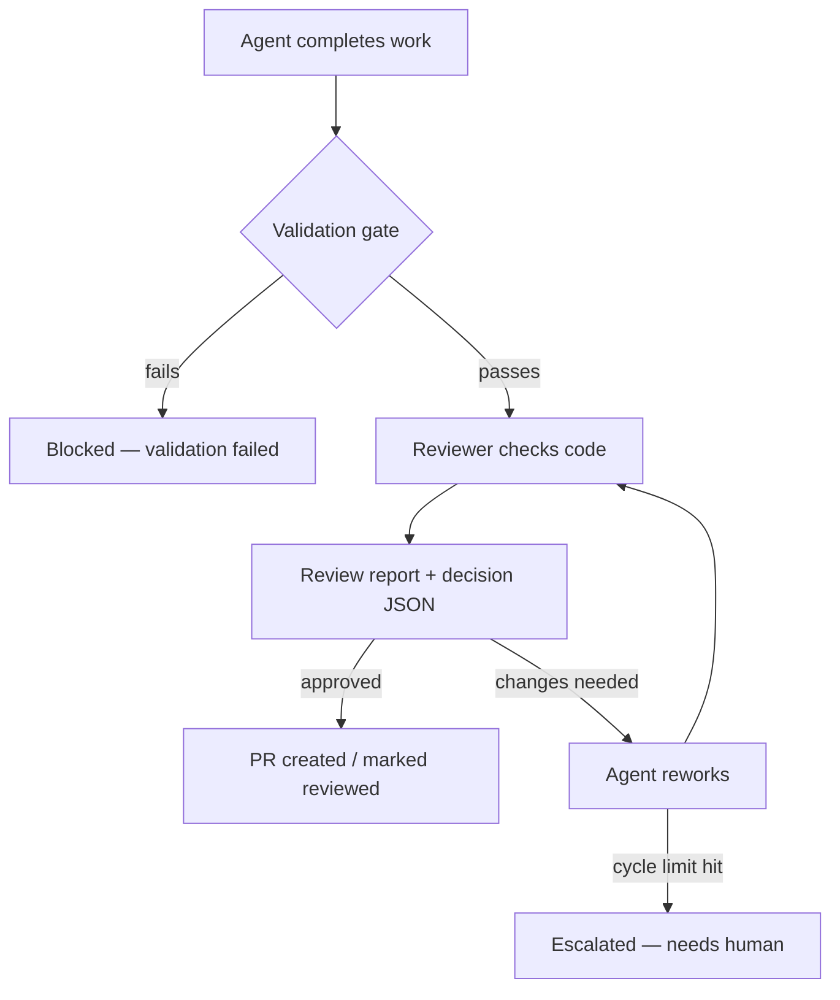
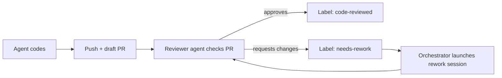
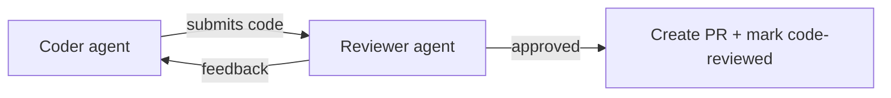
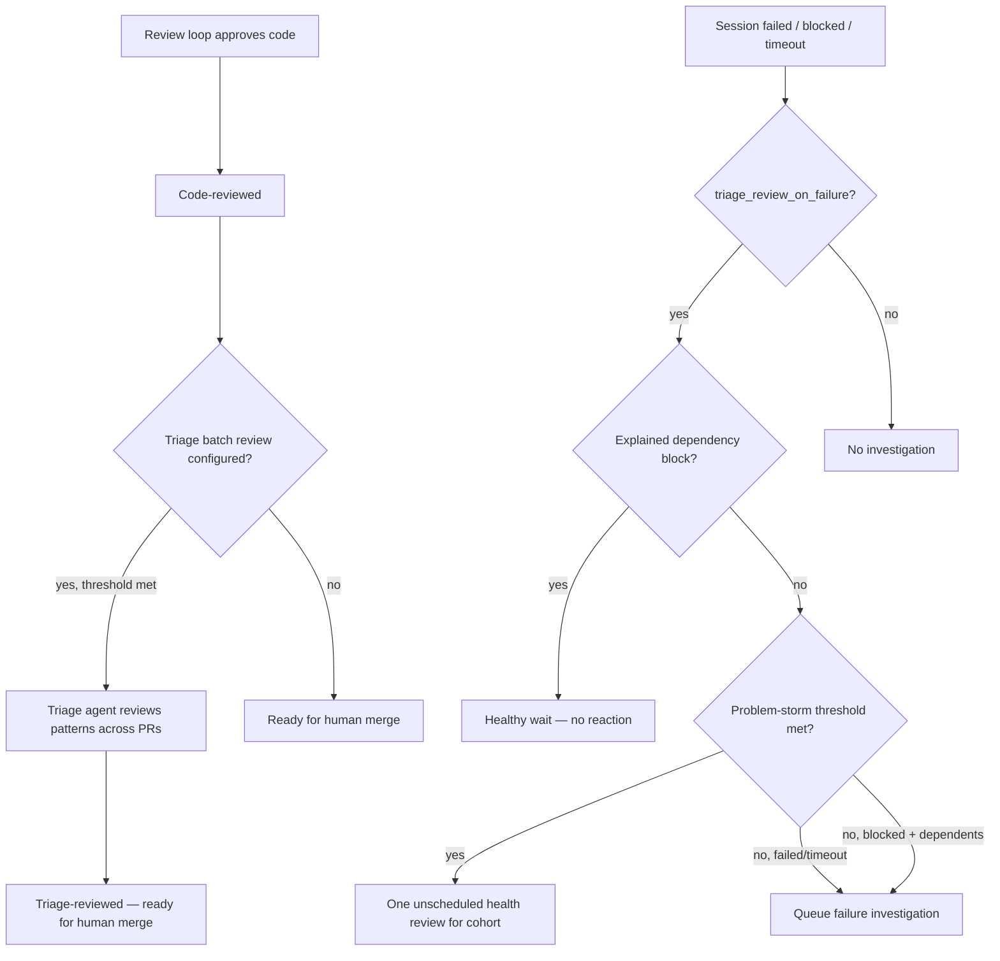
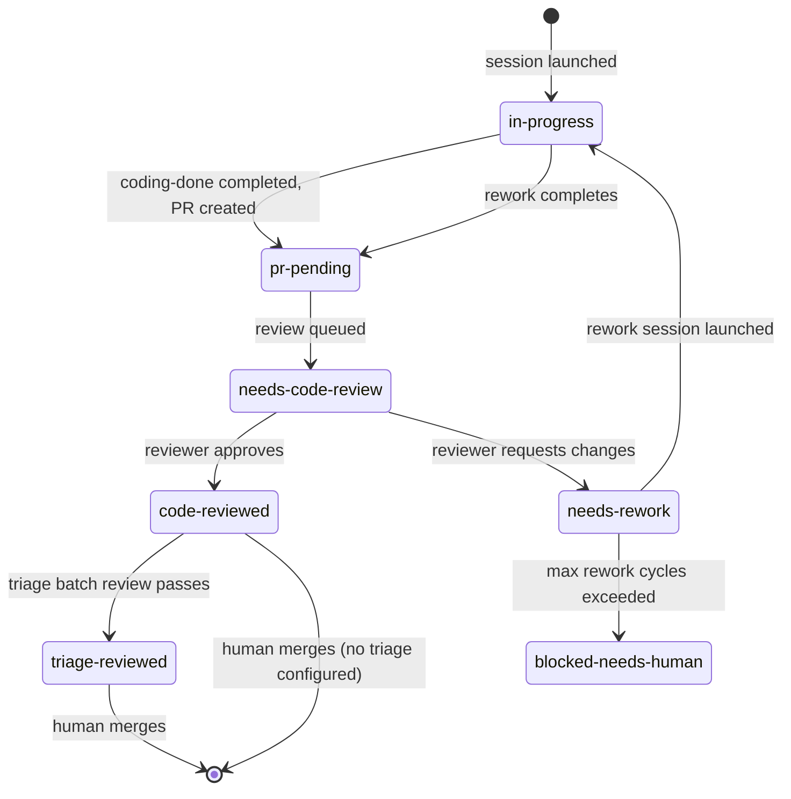

# Review Workflow

## The Review Loop

The core concept: an agent codes, a reviewer checks, and they iterate until the code is approved or the orchestrator escalates.

This flow begins after validation passes. When an agent completes work, the orchestrator processes the completion record — which includes running the validation gate (tests, linting, architecture checks). Only after validation succeeds does the review loop start.



**Cycle limits prevent infinite loops.** The orchestrator tracks rework iterations (`rework-cycle-N` labels on GitHub). After `max_rework_cycles` (default: 5), it stops the loop and escalates to a human. For in-process exchange modes, `max_rounds` and `max_no_progress` provide additional stopping conditions — if the reviewer reports no progress for consecutive rounds, the loop stops early.

## Exchange Mechanisms

The review loop can run through different mechanisms. The orchestrator selects the mechanism based on `review.exchange.mode` configuration.

### via-draft-pr

Traditional GitHub-based flow. The orchestrator creates a draft PR, launches a reviewer agent against it, and uses GitHub labels to drive the loop. No human intervention required — the orchestrator detects label changes and launches rework sessions automatically.



### via-local-loop (default)

Coder and reviewer agents alternate within the orchestrator process. Faster iteration — no GitHub round-trips. The orchestrator runs both agents sequentially and passes results between them.



Stops when: reviewer approves, `max_rounds` reached, or `max_no_progress` consecutive rounds without improvement.

## Review Artifacts

Before PR creation, each review exchange produces a paired artifact set:

- `review-report.md`: human-readable review with blocker and nit IDs. The coder's next rework prompt receives this full markdown report.
- `review-decision.json`: strict machine-readable decision. This is the authoritative routing/audit contract the orchestrator consumes.

Both artifacts describe the same review item IDs. The markdown is the review content source for operators, PR comments, and coder rework. The JSON drives orchestration with verdict/risk/policy, report pointer and hash, and stable item IDs; it does not need to duplicate report rationale or suggested-change prose. Dashboard and E2E issue detail surfaces show the report as the primary review artifact action and keep the JSON available as a secondary/menu action.

The decision JSON also carries an `abstraction_review` object. Reviewers must use it to say whether the change uses the right owner/port/command abstraction. If a bounded abstraction should be added in the same PR, reviewers set `abstraction_review.status` to `changes_requested` and include `A1`, `A2`, ... findings. An approved decision cannot carry required abstraction changes. If abstraction work is explicitly deferred, the reviewer must set `status` to `deferred` and include `follow_up_issue_url`.

Nits are classified in the same reviewer pass as blockers. They do not get a separate review pass. When `review.nits.default_policy` or a per-agent override is `address`, an approved review with only nits is converted into normal coder rework before PR creation. `surface` records and shows nits without blocking PR creation. `ignore` keeps them only in the persisted artifacts.

### via-mcp

Coder and reviewer communicate directly via MCP (Model Context Protocol). Same stopping conditions as via-local-loop, but agents exchange messages bidirectionally rather than through the orchestrator.

### auto

Selects `via-mcp` if both agents support it, otherwise falls back to `via-local-loop`.

## Multi-Stage Review Pipeline

After the review loop approves code, additional stages can run.



## Label State Transitions

Labels are the source of truth for issue state. The orchestrator recovers from crashes by reading labels — no database required.



## Configuration

```yaml
review:
  enabled: true
  default: "agent:reviewer"            # Default reviewer agent

  # Exchange mechanism
  exchange:
    mode: "via-local-loop"             # via-local-loop, via-draft-pr, via-mcp, auto
    loop:
      max_rounds: 10                   # Max iterations (local-loop / mcp)
      max_no_progress: 2              # Stop if reviewer reports no progress N times
      require_validation: true         # Reviewer must confirm validation passed

  # Rework cycle limit (via-draft-pr mode)
  max_rework_cycles: 5                # Escalate to needs-human after N cycles

  nits:
    default_policy: "surface"         # ignore, surface, address
    by_agent: {}                      # e.g. agent:frontend: address

  # Triage batch review
  triage_review_agent: "agent:triage"
  triage_review_threshold: 5           # Trigger after N code-reviewed PRs
  triage_review_on_failure: true       # React to failed/timed-out/unexplained blocked sessions

triage:
  health_review:
    interval_minutes: 240              # Periodic floor; 0 disables interval
    storm_threshold: 3                 # K recent problems -> one health review; 0 disables
    storm_window_minutes: 5            # Settle window for the problem cohort
```

## Key Design Decisions

1. **Orchestrator manages workflow** - Agents are workers with simple jobs. Orchestrator triggers the right agent at the right time.

2. **Two trigger modes**:
   - **Immediate (in-memory)**: Work agent completes -> orchestrator queues code review
   - **Recovery (label-based)**: On startup, scans for PRs with `needs-code-review` label

3. **Labels as source of truth** - Crash-safe: labels persist, orchestrator picks up where it left off

## Review Decision Policy (Strict)

Review decision criteria are maintained in `.claude/skills/review-workflow/SKILL.md` (canonical source).
Use that section for nit vs non-nit examples and strict approve/request-changes rules.

## Orchestrator Methods

| Method | Purpose |
|--------|---------|
| `queue_code_review()` | Queue PR for review (called on work completion) |
| `launch_review_session()` | Launch review agent for a PR |
| `process_pending_reviews()` | Process queued reviews (each loop) |
| `scan_needs_rework_prs()` | Scan for PRs needing rework |
| `launch_rework_session()` | Launch work agent to fix issues |
| `check_triage_review_trigger()` | Check if triage should trigger |

## Cleanup Configuration

Control when AI session tabs close and worktrees are removed:

```yaml
cleanup:
  with_triage:                    # When triage review is enabled
    close_ai_session_tabs: true   # Close tabs after triage review
    remove_worktrees: false       # Keep worktrees for reference

  without_triage:                 # When triage review is NOT enabled
    wait_for_code_review: true    # true = after code review, false = on completion
    close_ai_session_tabs: true
    remove_worktrees: false
```

## UI Phase Detection

Dashboard shows "Coding" or "Reviewing" based on session terminal ID:
- `issue-*` -> "Coding"
- `review-*` -> "Reviewing"
