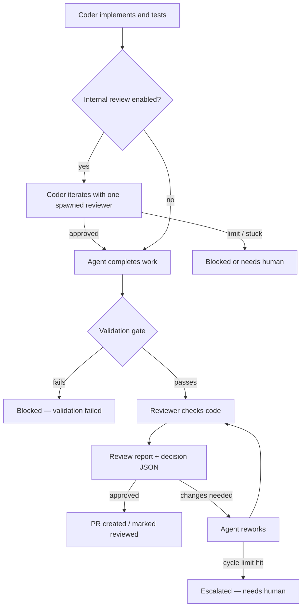
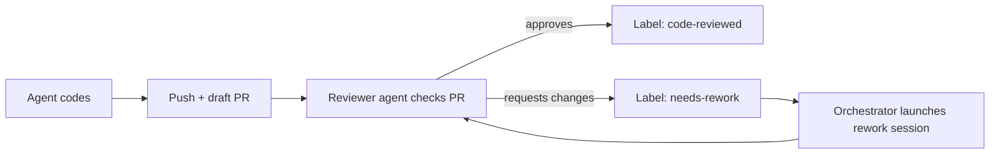
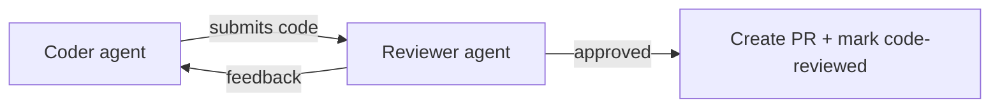
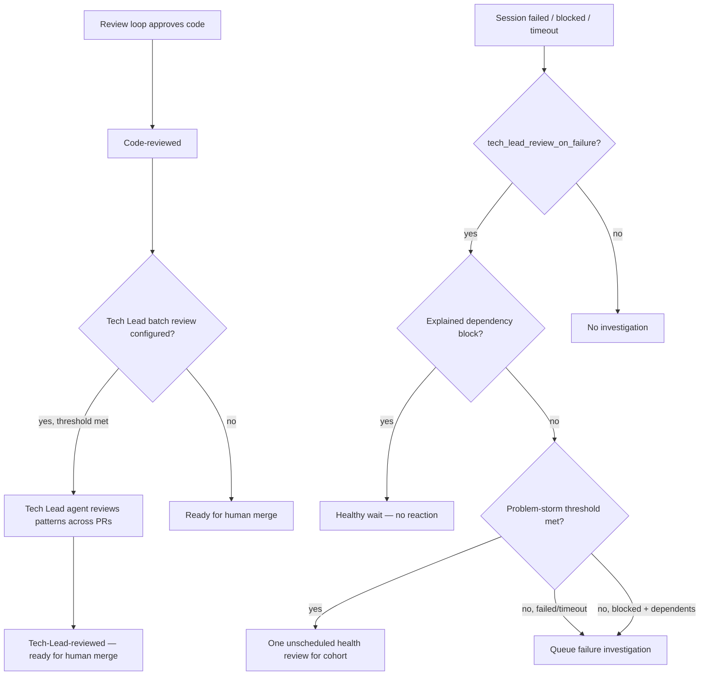
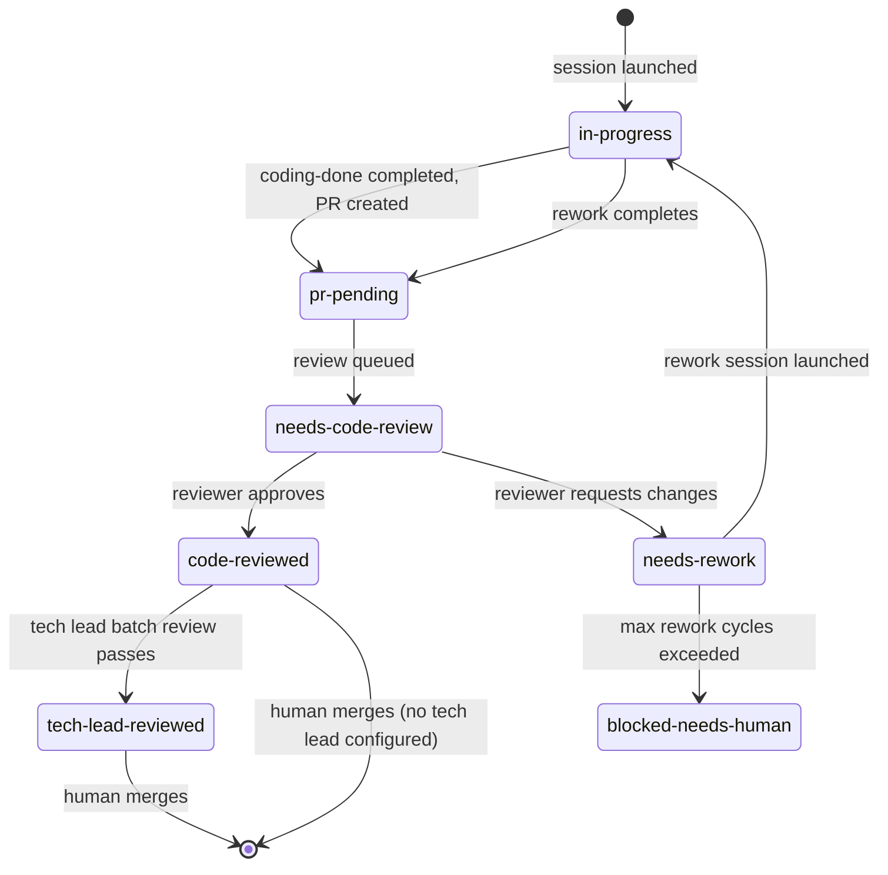

# Review Workflow

## The Review Loop

The core concept: an agent codes, a reviewer checks, and they iterate until the code is approved or the orchestrator escalates. An optional coder-owned internal review loop can run within each coder turn before that independent review.

The independent review flow begins after validation passes. When an agent completes work, the orchestrator processes the completion record — which includes running the validation gate (tests, linting, architecture checks). The optional internal review happens inside the coder turn before that completion; only after completion and validation does the external review loop start.


```mermaid
flowchart TD
  CODE["Coder implements and tests"] --> INTERNAL{"Internal review enabled?"}
  INTERNAL -->|yes| IREVIEW["Coder iterates with one spawned reviewer"]
  IREVIEW -->|approved| DONE["Agent completes work"]
  IREVIEW -->|limit / stuck| INTERNAL_BLOCK["Blocked or needs human"]
  INTERNAL -->|no| DONE
  DONE --> VAL{"Validation gate"}
  VAL -->|fails| VAL_BLOCK["Blocked — validation failed"]
  VAL -->|passes| REVIEW["Reviewer checks code"]
  REVIEW --> ARTIFACTS["Review report + decision JSON"]
  ARTIFACTS -->|approved| PR["PR created / marked reviewed"]
  ARTIFACTS -->|changes needed| REWORK["Agent reworks"]
  REWORK --> REVIEW
  REWORK -->|cycle limit hit| ESCALATE["Escalated — needs human"]
```

**Cycle limits prevent infinite loops.** The orchestrator tracks rework iterations (`rework-cycle-N` labels on GitHub). After `max_rework_cycles` (default: 5), it stops the loop and escalates to a human. For in-process exchange modes, `max_rounds` and `max_no_progress` provide additional stopping conditions — if the reviewer reports no progress for consecutive rounds, the loop stops early.

### Internal Review Within a Coder Turn

When `review.internal.enabled` is true, the orchestrator appends the configured
coder-facing instructions to every coder prompt: initial coding, validation
retry, draft-PR rework, and the coder side of an in-process review exchange.
The coder spawns exactly one lightweight internal reviewer and iterates with the
same reviewer until it returns `APPROVED`. A successful coder completion is not
allowed before that approval; an unavailable reviewer, unresolved finding, or
exhausted `max_rounds` requires a blocked or needs-human result.

This is intentionally a prompt-level, high-speed loop. It creates no review
artifacts, labels, completion protocol, or orchestrator-managed round state.
The ordinary external reviewer remains independent and receives the improved
implementation through the unchanged outer workflow.

## Exchange Mechanisms

The review loop can run through different mechanisms. The orchestrator selects the mechanism based on `review.exchange.mode` configuration.

### via-draft-pr

Traditional GitHub-based flow. The orchestrator creates a draft PR, launches a reviewer agent against it, and uses GitHub labels to drive the loop. No human intervention required — the orchestrator detects label changes and launches rework sessions automatically.


```mermaid
flowchart LR
  CODE["Agent codes"] --> PUSH["Push + draft PR"]
  PUSH --> REV["Reviewer agent checks PR"]
  REV -->|approves| LABEL1["Label: code-reviewed"]
  REV -->|requests changes| LABEL2["Label: needs-rework"]
  LABEL2 --> REWORK["Orchestrator launches rework session"]
  REWORK --> REV
```

### via-local-loop (default)

Coder and reviewer agents alternate within the orchestrator process. Faster iteration — no GitHub round-trips. The orchestrator runs both agents sequentially and passes results between them.


```mermaid
flowchart LR
  CODE["Coder agent"] -->|submits code| REV["Reviewer agent"]
  REV -->|feedback| CODE
  REV -->|approved| DONE["Create PR + mark code-reviewed"]
```

Stops when: reviewer approves, `max_rounds` reached, or `max_no_progress` consecutive rounds without improvement.

## Review Artifacts

Before PR creation, each review exchange produces a paired artifact set:

- `review-report.md`: human-readable review with blocker and nit IDs. The coder's next rework prompt receives this full markdown report.
- `review-decision.json`: strict machine-readable decision. This is the authoritative routing/audit contract the orchestrator consumes.

Both artifacts describe the same review item IDs. The markdown is the review content source for operators, PR comments, and coder rework. The JSON drives orchestration with verdict/risk/policy, report pointer and hash, and stable item IDs; it does not need to duplicate report rationale or suggested-change prose. Dashboard and E2E issue detail surfaces show the report as the primary review artifact action and keep the JSON available as a secondary/menu action.

The decision JSON also carries an `abstraction_review` object. Reviewers must use it to say whether the change uses the right owner/port/command abstraction. If a bounded abstraction should be added in the same PR, reviewers set `abstraction_review.status` to `changes_requested` and include `A1`, `A2`, ... findings. An approved decision cannot carry required abstraction changes. If abstraction work is explicitly deferred, the reviewer must set `status` to `deferred` and include `follow_up_issue_url`.

Nits are classified in the same reviewer pass as blockers. They do not get a separate review pass. When `review.nits.default_policy` or a per-agent override is `address`, an approved review with only nits is converted into normal coder rework before PR creation. `surface` records and shows nits without blocking PR creation. `ignore` keeps them only in the persisted artifacts.

### via-mcp

Coder and reviewer communicate directly via MCP (Model Context Protocol). Same stopping conditions as via-local-loop, but agents exchange messages bidirectionally rather than through the orchestrator.

### auto

Selects `via-mcp` if both agents support it, otherwise falls back to `via-local-loop`.

## Multi-Stage Review Pipeline

After the review loop approves code, additional stages can run.


```mermaid
flowchart TD
  LOOP["Review loop approves code"] --> CR["Code-reviewed"]
  CR --> TECH_LEAD{"Tech Lead batch review configured?"}
  TECH_LEAD -->|yes, threshold met| TR["Tech Lead agent reviews patterns across PRs"]
  TR --> DONE["Tech-Lead-reviewed — ready for human merge"]
  TECH_LEAD -->|no| DONE2["Ready for human merge"]

  FAIL["Session failed / blocked / timeout"] --> TFAIL{"tech_lead_review_on_failure?"}
  TFAIL -->|yes| CLASSIFY{"Explained dependency block?"}
  CLASSIFY -->|yes| WAIT["Healthy wait — no reaction"]
  CLASSIFY -->|no| STORM{"Problem-storm threshold met?"}
  STORM -->|yes| HEALTH["One unscheduled health review for cohort"]
  STORM -->|no, failed/timeout| INVEST["Queue failure investigation"]
  STORM -->|no, blocked + dependents| INVEST
  TFAIL -->|no| SKIP["No investigation"]
```

## How a Failure Investigation Ends (#6971)

An investigation is only finished when it leaves a **disposition** — something
machine-readable that says what happens next. Without one the blocking label
stays, the stuck sweep re-discovers the issue as "still stuck and NOT owned",
spends a unit of recovery budget, and commissions another session to re-derive
the same verdict (issue #6410 was investigated three times for one conclusion).

A failure investigation must propose a focus-issue diagnosis and exactly one
terminal action. `reset_retry` and `kill_hung_session` use configured direct or
gated authority. `escalate_to_human` uses the existing marker-owned human
lifecycle, preserving independent human blocks. `defer_to_tracker` commits a
wait only for a launch-granted, open same-repository prerequisite; arbitrary
agent-provided issue numbers are refused. A kill requires an observed worker
generation, and a stale investigation remedy cannot count as successful unless
its owner positively proves the target recovered.

Tracker publication is a single completion-mandatory command. It persists an
admitted `prepared` intent before publishing the guarded explanation, revalidates
the claim, expected state, and dependency, then conditionally commits `waiting`.
The tick's existing ledger-planning path resumes a prepared command after the
original session and grant are gone. The authority store owns an exclusive
publication lock across marker lookup, remote write, and conditional commit.
Independent processes share that lock; the kernel releases it after a crash.
A deterministic remote marker then avoids repeating the explanation on replay. Publication failure withholds successful completion,
while the durable pending owner retries without creating a new human gate.

Each incident gets one wait with a 24-hour deadline. New decisions and process
restarts cannot renew it. Closed or missing trackers latch `reassess` sooner;
indeterminate reads preserve only an unexpired active wait. Retained context
travels in the next investigation's `tech-lead-data/recovery-context.json`, which
requires remediation or an explicit human handoff instead of another wait.
Only positive target recovery releases the incident and recovery budget; absence
from a filtered scan does not. A recovered tombstone rejects old-session replay,
while an investigation launched after recovery may start a new incident.

The ledger lives in the existing tech-lead authority store. Missing durable
state never grants authority; malformed rows fail loudly. New tracker relations
must be established through an authorized prerequisite workflow before use.

## Requesting a Tech-Lead Run from the Dashboard

Every tech-lead run — whether a timer, a failure, a problem storm, the one-shot
CLI, or an operator's click started it — is admitted by one control-layer owner,
`TechLeadRunCoordinator`. It models each run's **scope** explicitly:

| Scope | Requested from | Concurrency |
|---|---|---|
| Global health review (whole board) | Dashboard actions menu → **Run board health review** | Exclusive: no other tech-lead run executes alongside it |
| Issue investigation (one focus issue) | A blocked card's actions menu and the issue detail drawer → **Investigate with tech lead** | Up to `tech_lead.max_concurrent`, one run per issue |

A queued global run acts as a **barrier**: targeted work queued behind it waits
until it completes, and the global run itself waits for active tech-lead
sessions to drain. `worker_budget.tech_lead_slot_availability` still owns the
numeric capacity; the coordinator owns only the semantic conflicts, so the two
cannot drift.

Both dashboard actions POST one discriminated command to `/api/tech-lead/runs`:

```json
{"scope": {"kind": "issue", "issue_number": 42}}
{"scope": {"kind": "global_health_review"}}
```

The response is a typed admission outcome — `queued`, `already_queued`,
`already_running`, `paused`, `not_configured`, `not_eligible`, `claim_conflict`,
or `failed` — with a machine-readable `reason` and human `detail` the dashboard
surfaces as a durable toast. Repeated clicks coalesce onto one logical run
(`run_key`), and an issue-scoped request is revalidated against GitHub right
before it is queued, so a closed or no-longer-blocked target is refused rather
than launched.

Admission only ENQUEUES. The planner still launches, so a hand-aimed run gets
byte-for-byte the same evidence map, launch authority, and sandboxing an
automatic one does — and the dashboard never invokes the one-shot
`orchestrator health-review` CLI, which would take the repository lock and pause
planning under the running engine.

### Launch-time revalidation

Admission is not a standing licence to launch. A queued investigation can wait
many ticks — behind the global barrier, behind capacity, behind an open provider
circuit — and in that window a human can close or unblock its subject. So every
tick the planner re-asks the same eligibility rule against the board it already
fetched, and **withdraws** (not merely holds) any investigation whose subject is
closed or no longer blocked, emitting `tech_lead.run_withdrawn` with the reason.
Withdrawal removes the queue entry, because that entry is an investigation's only
durable record: leaving it would strand the run and keep the dashboard's
"Tech lead queued" affordance lit on an issue with nothing left to investigate.

Only positive evidence withdraws a run. The board is filtered by agent label,
milestone, and `filtering.exclude_labels` — which `tech_lead.inherit_labels`
deliberately re-admits for tech-lead work — so a subject that is merely *absent*
from the board proves nothing and its run is kept. Global runs are exempt: a
health-review anchor is not a blocked work item, and blocked-label eligibility
says nothing about whether the board is still worth auditing.

## Label State Transitions

Labels are the source of truth for issue state. The orchestrator recovers from crashes by reading labels — no database required.


```mermaid
stateDiagram-v2
  state "in-progress" as IP
  state "pr-pending" as PR
  state "needs-code-review" as NCR
  state "code-reviewed" as CR
  state "needs-rework" as NR
  state "tech-lead-reviewed" as TR
  state "blocked-needs-human" as BNH

  [*] --> IP : session launched
  IP --> PR : coding-done completed, PR created
  PR --> NCR : review queued
  NCR --> CR : reviewer approves
  NCR --> NR : reviewer requests changes
  NR --> IP : rework session launched
  IP --> PR : rework completes
  CR --> TR : tech lead batch review passes
  NR --> BNH : max rework cycles exceeded
  TR --> [*] : human merges
  CR --> [*] : human merges (no tech lead configured)
```

## Configuration

```yaml
review:
  enabled: true
  default: "agent:reviewer"            # Default reviewer agent

  # Coder-owned loop inside every coder turn (independent review still follows)
  internal:
    enabled: false
    max_rounds: 5                      # Reviewer verdicts before coder blocks
    instructions: ".io/internal-review.md" # Relative to the configured repository root

  # Exchange mechanism
  exchange:
    mode: "via-local-loop"             # via-local-loop, via-draft-pr, via-mcp, auto
    loop:
      max_rounds: 10                   # Max iterations (local-loop / mcp)
      max_no_progress: 2              # Stop if reviewer reports no progress N times
      require_validation: true         # Reviewer must confirm validation passed

  # Rework cycle limit (via-draft-pr mode)
  max_rework_cycles: 5                # Escalate to needs-human after N cycles

  nits:
    default_policy: "surface"         # ignore, surface, address
    by_agent: {}                      # e.g. agent:frontend: address

  # Tech Lead batch review
  tech_lead_review_agent: "agent:tech-lead"
  tech_lead_review_threshold: 5           # Trigger after N code-reviewed PRs
  tech_lead_review_on_failure: true       # React to failed/timed-out/unexplained blocked sessions

tech_lead:
  enabled: true                         # One master switch for all new tech-lead work
  health_review:
    interval_minutes: 240              # Periodic floor; 0 disables interval
    storm_threshold: 3                 # K recent problems -> one health review; 0 disables
    storm_window_minutes: 5            # Settle window for the problem cohort
```

Set only `tech_lead.enabled: false` to stop all new batch reviews, failure
investigations, periodic/storm health reviews, stuck sweeps, manual runs,
proposal reconciliation, and finding promotion. The detailed settings remain
configured for a one-line re-enable. Already-running sessions may finish. For
backward compatibility, omitting the key retains the historical behavior:
configuring `review.tech_lead_review_agent` enables the workflow.

## Key Design Decisions

1. **Orchestrator manages workflow** - Agents are workers with simple jobs. Orchestrator triggers the right agent at the right time.

2. **Two trigger modes**:
   - **Immediate (in-memory)**: Work agent completes -> orchestrator queues code review
   - **Recovery (label-based)**: On startup, scans for PRs with `needs-code-review` label

3. **Labels as source of truth** - Crash-safe: labels persist, orchestrator picks up where it left off

## Review Decision Policy (Strict)

Review decision criteria are maintained in `.claude/skills/review-workflow/SKILL.md` (canonical source).
Use that section for nit vs non-nit examples and strict approve/request-changes rules.

## Orchestrator Methods

| Method | Purpose |
|--------|---------|
| `queue_code_review()` | Queue PR for review (called on work completion) |
| `launch_review_session()` | Launch review agent for a PR |
| `process_pending_reviews()` | Process queued reviews (each loop) |
| `scan_needs_rework_prs()` | Scan for PRs needing rework |
| `launch_rework_session()` | Launch work agent to fix issues |
| `check_tech_lead_review_trigger()` | Check if tech lead should trigger |

## Cleanup Configuration

Control when AI session tabs close and worktrees are removed:

```yaml
cleanup:
  with_tech_lead:                    # When tech lead review is enabled
    close_ai_session_tabs: true   # Close tabs after tech lead review
    remove_worktrees: true        # Remove owned worktrees after tech lead review

  without_tech_lead:                 # When tech lead review is NOT enabled
    wait_for_code_review: true    # true = after code review, false = on completion
    close_ai_session_tabs: true
    remove_worktrees: true
```

Worktree removal defaults to `true` for new and omitted configurations. It
still waits for the applicable review gate. Set it to `false` to retain issue
worktrees for inspection. Cleanup timing and actions are independent: if either
`close_ai_session_tabs` or `remove_worktrees` is enabled, the selected actions
wait for the applicable review gate. For example, setting tab closure to
`false` and worktree removal to `true` leaves the tab open and removes the
checkout only after review. Without tech-lead review,
`wait_for_code_review: false` instead runs the selected actions on completion.
If both action flags are `false`, an ordinary successful completion does not
enter the cleanup lifecycle. Failure/timeout/block teardown and disposable
scratch-worktree removal remain immediate lifecycle boundaries.

Review-gated cleanup removes only the checkout and preserves its local branch,
including local-only commits. Branch deletion is reserved for explicitly
disposable scratch/reset lifecycle owners. On startup, the orchestrator also
reconciles proven inactive reviewer and tech-lead scratch worktrees. Manual,
active, activity-unknown, initializing-engine, ambiguous, and reviewer
worktrees whose detached HEAD differs from the exact tip recorded by the
reviewer lifecycle are retained. Reviewer worktrees created before that tip
marker existed use the stricter legacy proof that HEAD still equals the
registered parent worktree tip.

## UI Phase Detection

Dashboard shows "Coding" or "Reviewing" based on session terminal ID:
- `issue-*` -> "Coding"
- `review-*` -> "Reviewing"

### Scoped tech-lead rework

`request_rework` addresses a specific existing PR after a later tech-lead finding.
The agent targets only PRs in its `scoped-rework-targets.json` launch facts and
supplies finding IDs plus actionable feedback. The immutable stored operation
binds the repository, PR, linked issue, head, branch, observed labels and report.
Editing the proposal issue body cannot change the approved instruction. A durable
creation intent and an opaque marker recover an accepted GitHub create before
its response or local stored-op write completes.

`tech_lead.authority.request_rework` defaults to `propose`. In Control Center's
repository dashboard, open **Tech-lead rework proposals** to inspect the evidence,
head, eligibility and predicted changes. **Approve rework** removes the same
`proposed-tech-lead` gate that an operator can remove on GitHub; **Decline** closes
the proposal. The engine executes approved operations through the existing
proposal lifecycle. Pausing the engine preserves inspection and consent while
execution waits for resume.

Approval preserves the branch, invalidates stale review labels and publishes
`needs-rework` last. The instruction is journaled before label writes and is read
again at normal rework launch, including recovered/already-queued work. Pending
work carries exact request IDs, with fresh PR/head/link checks before spawn.
The ordinary durable work claim binds those IDs to the consuming run before
starting the provider; failed spawns release them, and restoration adopts only
the matching run. Only an
observed operator human block may be cleared; independent recorded lifecycle
causes retain their block. Existing agent, dependency, milestone and rework-cycle
policy still controls launch.

A changed head or closed-unmerged/missing target is stale. A merged PR receives
one forward-fix issue with the same evidence and routing, using the original
approval as consent. Durable receipts and authoritative marker recovery prevent
repeating the rework or forward fix after a restart. Finding promotion from
`flag_pattern` remains the separate lane for repeated systemic findings.
