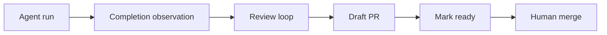

# IMPLEMENT_THIS.md — V3C (CUMULATIVE, MECHANICAL, VERIFIED)

Snapshot: issue-orchestrator-source-20260101-200339.zip
Anchors:
- web.py /api/refresh route line ~354, handler line ~355
- e2e conftest trigger_refresh line ~1376, inflight tracker class line ~1422
- github_http.py _request_json line ~145, list_issues line ~224

Non-negotiables:
- Preserve existing validate-before-push AND validation signature skip optimization.
- Cache updates ONLY from observed GET payloads.
- Correctness-critical writes always use write→observe verification.
- No httpx/subprocess in domain/control/ports.

==================================================================
PHASE 1 — ETAG + INFLIGHT DETERMINISTIC DISCOVERY
==================================================================
WHY:
- List endpoint may 304 while new issues exist; tests track inflight IDs. We must not add sleeps or disable ETags.

FILES:
- src/issue_orchestrator/web.py
- tests/e2e/conftest.py
- src/issue_orchestrator/orchestrator.py
- src/issue_orchestrator/execution/github_http.py
- src/issue_orchestrator/execution/github_adapter.py
- tests/unit/test_github_http.py
- tests/unit/test_github_adapter.py
- tests/e2e/test_inflight_refresh_discovers_issue.py (create)

STEPS:
1) web.py:
   - In refresh() handler, parse optional JSON body:
     - key: inflight_stable_ids: list[str]
   - Call: _orchestrator.request_refresh(inflight_stable_ids=set(ids))
2) conftest.py:
   - Modify trigger_refresh(...) to accept optional payload.
   - In _InflightRefreshTracker.ensure_refreshed:
     - send payload { "inflight_stable_ids": sorted(pending) }
3) orchestrator.py:
   - Add self._inflight_stable_ids: dict[str,float] (expires_at monotonic)
   - TTL=90s; prune each tick
   - When refresh requested and inflight non-empty, pass required_stable_ids into list_issues.
   - Remove observed inflight IDs after discovery.
4) github_http.py:
   - Add param use_cache: bool=True to list_issues(...)
   - Pass through to _request_json(...use_cache=use_cache)
5) github_adapter.py:
   - Add param required_stable_ids: set[str] | None to list_issues(...)
   - If missing after first call, retry once with use_cache=False
   - If still missing, log diagnostic and return without looping
6) Tests:
   - Unit test: list_issues(use_cache=False) sends no If-None-Match and does not use cached 304
   - Unit test: adapter triggers second call with use_cache=False when missing required IDs
   - E2E: create issue while orchestrator runs; register inflight; call refresh; assert discovered within bounded time

GATES:
- pytest -q tests/unit/test_github_http.py
- pytest -q tests/unit/test_github_adapter.py
- pytest -q tests/e2e/test_inflight_refresh_discovers_issue.py
- rg "sleep\(" tests/e2e (no new sleeps)

==================================================================
PHASE 2 — REPO LAYOUT NORMALIZATION
==================================================================
WHY:
- Make hexagonal boundaries obvious; move GitHub I/O out of execution.

STEPS:
- Create adapters/github, adapters/terminal, adapters/worktree, entrypoints/
- Move 1:1:
  - execution/github_http.py -> adapters/github/http_client.py
  - execution/github_cache.py -> adapters/github/cache.py
  - execution/github_adapter.py -> adapters/github/github_adapter.py
  - execution/github_issue.py -> adapters/github/github_issue.py
  - execution/github_repo.py -> adapters/github/repo.py
- Update imports.

GATES:
- rg "issue_orchestrator\.execution\.github" -S src/issue_orchestrator => 0
- rg "httpx" src/issue_orchestrator/{control,domain,ports} -S => 0
- pytest -q tests/unit

==================================================================
PHASE 3 — ORCHESTRATOR MEDIATOR REFACTOR
==================================================================
WHY:
- orchestrator.py too large; must delegate.

STEPS:
- Create (if missing):
  - src/issue_orchestrator/control/session_launcher.py
  - src/issue_orchestrator/control/completion_handler.py
  - src/issue_orchestrator/control/github_workflow.py
  - src/issue_orchestrator/control/worktree_manager.py
  - src/issue_orchestrator/control/orchestrator_support.py
- Move methods per table (copy exact method, inject dependencies, update calls).

METHOD TABLE:
| Method | Destination |
|---|---|
| `log_transition` | `src/issue_orchestrator/control/orchestrator_support.py:OrchestratorSupport` |
| `__post_init__` | `src/issue_orchestrator/control/orchestrator_support.py:OrchestratorSupport` |
| `repository_host` | `src/issue_orchestrator/control/orchestrator_support.py:OrchestratorSupport` |
| `_completion_processor` | `src/issue_orchestrator/control/completion_handler.py:CompletionHandler` |
| `_session_controller` | `src/issue_orchestrator/control/session_launcher.py:SessionLauncher` |
| `_pr_scanner` | `src/issue_orchestrator/control/github_workflow.py:GitHubWorkflow` |
| `_session_launcher` | `src/issue_orchestrator/control/session_launcher.py:SessionLauncher` |
| `_cleanup_manager` | `src/issue_orchestrator/control/orchestrator_support.py:OrchestratorSupport` |
| `_completion_handler` | `src/issue_orchestrator/control/completion_handler.py:CompletionHandler` |
| `_session_restorer` | `src/issue_orchestrator/control/session_launcher.py:SessionLauncher` |
| `_state_machines` | `src/issue_orchestrator/control/orchestrator_support.py:OrchestratorSupport` |
| `_sm` | `src/issue_orchestrator/control/orchestrator_support.py:OrchestratorSupport` |
| `_aa` | `src/issue_orchestrator/control/orchestrator_support.py:OrchestratorSupport` |
| `_fg` | `src/issue_orchestrator/control/orchestrator_support.py:OrchestratorSupport` |
| `_planner` | `src/issue_orchestrator/control/orchestrator_support.py:OrchestratorSupport` |
| `_wm` | `src/issue_orchestrator/control/orchestrator_support.py:OrchestratorSupport` |
| `_get_session_name` | `src/issue_orchestrator/control/session_launcher.py:SessionLauncher` |
| `_get_worktree_path` | `src/issue_orchestrator/control/worktree_manager.py:WorktreeManager` |
| `_session_launcher_callback` | `src/issue_orchestrator/control/session_launcher.py:SessionLauncher` |
| `_launch_issue_by_number` | `src/issue_orchestrator/control/github_workflow.py:GitHubWorkflow` |
| `_launch_review_by_number` | `src/issue_orchestrator/control/completion_handler.py:CompletionHandler` |
| `_launch_rework_by_number` | `src/issue_orchestrator/control/completion_handler.py:CompletionHandler` |
| `_launch_triage_by_number` | `src/issue_orchestrator/control/completion_handler.py:CompletionHandler` |
| `_get_issue_machine` | `src/issue_orchestrator/control/github_workflow.py:GitHubWorkflow` |
| `_get_session_machine` | `src/issue_orchestrator/control/session_launcher.py:SessionLauncher` |
| `_get_review_machine` | `src/issue_orchestrator/control/completion_handler.py:CompletionHandler` |
| `_restore_running_sessions` | `src/issue_orchestrator/control/session_launcher.py:SessionLauncher` |
| `_parse_session_ref` | `src/issue_orchestrator/control/session_launcher.py:SessionLauncher` |
| `_create_session` | `src/issue_orchestrator/control/session_launcher.py:SessionLauncher` |
| `_session_exists` | `src/issue_orchestrator/control/session_launcher.py:SessionLauncher` |
| `_kill_session` | `src/issue_orchestrator/control/session_launcher.py:SessionLauncher` |
| `_refresh_issue` | `src/issue_orchestrator/control/github_workflow.py:GitHubWorkflow` |
| `_build_labels` | `src/issue_orchestrator/control/github_workflow.py:GitHubWorkflow` |
| `_get_milestone_filter` | `src/issue_orchestrator/control/orchestrator_support.py:OrchestratorSupport` |
| `_startup_manager` | `src/issue_orchestrator/orchestrator.py (stays)` |
| `issue_branches_fn` | `src/issue_orchestrator/control/worktree_manager.py:WorktreeManager` |
| `launch_session` | `src/issue_orchestrator/control/session_launcher.py:SessionLauncher` |
| `handle_session_completion` | `src/issue_orchestrator/control/session_launcher.py:SessionLauncher` |
| `_immediate_cleanup` | `src/issue_orchestrator/control/orchestrator_support.py:OrchestratorSupport` |
| `tick` | `src/issue_orchestrator/orchestrator.py (stays)` |
| `_check_health` | `src/issue_orchestrator/control/orchestrator_support.py:OrchestratorSupport` |
| `_process_active_sessions` | `src/issue_orchestrator/control/session_launcher.py:SessionLauncher` |
| `_run_planning_cycle` | `src/issue_orchestrator/orchestrator.py (stays)` |
| `_clear_discovered_facts` | `src/issue_orchestrator/control/orchestrator_support.py:OrchestratorSupport` |
| `_emit_heartbeat_if_needed` | `src/issue_orchestrator/control/orchestrator_support.py:OrchestratorSupport` |
| `request_shutdown` | `src/issue_orchestrator/orchestrator.py (stays)` |
| `request_refresh` | `src/issue_orchestrator/control/orchestrator_support.py:OrchestratorSupport` |
| `pause` | `src/issue_orchestrator/orchestrator.py (stays)` |
| `resume` | `src/issue_orchestrator/orchestrator.py (stays)` |
| `_pause_issue_for_reconciliation` | `src/issue_orchestrator/control/github_workflow.py:GitHubWorkflow` |
| `_apply_plan` | `src/issue_orchestrator/control/orchestrator_support.py:OrchestratorSupport` |
| `_update_state_after_action` | `src/issue_orchestrator/control/orchestrator_support.py:OrchestratorSupport` |
| `_fetch_all_issues` | `src/issue_orchestrator/control/github_workflow.py:GitHubWorkflow` |
| `update_queue_cache` | `src/issue_orchestrator/control/orchestrator_support.py:OrchestratorSupport` |
| `_update_dependency_problems` | `src/issue_orchestrator/control/github_workflow.py:GitHubWorkflow` |
| `launch_review_session` | `src/issue_orchestrator/control/session_launcher.py:SessionLauncher` |
| `_launch_triage_session` | `src/issue_orchestrator/control/session_launcher.py:SessionLauncher` |
| `process_deferred_cleanups` | `src/issue_orchestrator/control/github_workflow.py:GitHubWorkflow` |
| `_recover_orphaned_cleanups` | `src/issue_orchestrator/control/orchestrator_support.py:OrchestratorSupport` |
| `scan_needs_code_review_prs` | `src/issue_orchestrator/control/completion_handler.py:CompletionHandler` |
| `scan_needs_rework_prs` | `src/issue_orchestrator/control/completion_handler.py:CompletionHandler` |
| `reconcile_orphaned_pr_labels` | `src/issue_orchestrator/control/github_workflow.py:GitHubWorkflow` |
| `launch_rework_session` | `src/issue_orchestrator/control/session_launcher.py:SessionLauncher` |
| `handle_signal` | `src/issue_orchestrator/control/orchestrator_support.py:OrchestratorSupport` |

GATES:
- orchestrator.py LOC <= 300 (excluding imports/docstrings)
- pytest -q tests/unit

==================================================================
PHASE 4 — CORRECTNESS HARDENING (MECHANICAL)
==================================================================
WHY:
- Don’t trust writes; handle systemic vs issue-local failures deterministically.

STEPS:
- Audit every GitHub mutation method in adapters/github/github_adapter.py and ensure it calls _verify_write.
- Ensure verify predicates do fresh reads (bypass TTL; conditional GET ok).
- Implement failure classification:
  - SYSTEMIC -> orchestrator.pause + probe + resume
  - ISSUE_LOCAL -> apply needs-reconcile label for that issue and skip
- Ensure cache updates only occur in observed GET paths (200) and 304 reuse.

GATES:
- Add/extend unit tests:
  - systemic timeout -> pauses and resumes
  - predicate false -> needs-reconcile applied
- pytest -q tests/unit -k "verify or reconciliation"

==================================================================
PHASE 5 — GUARDRAILS (MECHANICAL)
==================================================================
WHY:
- Prevent regression; agents cannot bypass.

STEPS:
- Keep validate-before-push as the single gate.
- Ensure validate-before-push runs (in order):
  - import-linter
  - AST guardrails
  - pyright strict-core
  - unit tests
- CI runs: make validate-before-push
- Preserve validation signature skip logic.

GATES:
- make validate-before-push passes

==================================================================
PHASE 6 — CALLING CARD (MECHANICAL)
==================================================================
WHY:
- Reviewer must understand in 10 minutes and run a demo.

STEPS:
1) Replace README.md content with this exact template, then customize only repo name/links:

```markdown
# Issue-Orchestrator

## What it is
Issue‑Orchestrator is a local-first control plane that turns GitHub issues into a managed agent workflow (code → review → PR), with guardrails for untrusted agents.

## Who it’s for
- Solo builders and small teams using coding agents on real repos
- People who want strong safety/guardrails (humans merge, verification, reconciliation)

## Who it’s not for
- Teams seeking a hosted SaaS orchestrator
- Workflows where agents must merge directly

## Guarantees (guardrails)
1) **Humans merge**: the orchestrator/agents never merge PRs.
2) **Write→Observe**: correctness-critical writes are verified by observation before state advances.
3) **Reconciliation-first**: drift pauses/quarantines work; state never “guesses”.

## Quickstart
```bash
python -m venv .venv && source .venv/bin/activate
pip install -e ".[dev]"
export ISSUE_ORCH_GITHUB_TOKEN=ghp_...
issue-orchestrator setup
issue-orchestrator run --once
```

## How it works
```mermaid
flowchart LR
  GH[GitHub state] --> OBS[Observe (snapshots)]
  OBS --> PLAN[Plan (Planner)]
  PLAN --> APPLY[Apply (ActionApplier)]
  APPLY --> GH
  APPLY --> EVT[Events/SSE]
  EVT --> UI[Web UI / Tests]
```



## Guardrails & boundaries
- Core: domain/control/ports contain no I/O
- Adapters perform GitHub/terminal/worktree I/O
- validate-before-push is authoritative; validation signature skip is preserved

## Links
- docs/design/BOUNDARIES.md
- docs/design/adr/

```

2) Implement demo per this contract:

```markdown
# Demo contract (mechanical)

Add a Makefile target `demo` OR a CLI command `issue-orchestrator demo`.

**Behavior**:
- If ISSUE_ORCH_GITHUB_TOKEN is not set:
  - print: "DEMO: no token set; running dry-run"
  - run planner against local fixtures (no GitHub writes)
  - exit 0
- If token set and repo configured:
  - create a demo issue with known prefix (e.g. [DEMO-001])
  - trigger one run cycle that reaches draft PR or needs-human
  - print the issue URL and PR URL
  - exit 0

**Gate**: `make demo` exits 0 and prints one of:
- "DEMO: no token set; running dry-run"
- "DEMO: created issue" and "DEMO: opened draft PR"

```

3) Create docs/internal/golden_tests.md with this exact starting list:

```markdown
# Golden tests (must stay green)

- `tests/unit/test_github_http.py::test_get_issue_uses_etag_cache`
- `tests/unit/test_action_applier.py::test_reconciliation_disabled`
- `tests/unit/test_action_applier.py::test_reconciliation_enabled`
- `tests/unit/test_action_applier.py::test_expected_not_enforced_when_reconcile_disabled`
- `tests/unit/test_arch_guardrails.py::test_blocks_subprocess_import_in_control`
- `tests/unit/test_arch_guardrails.py::test_allows_subprocess_in_execution`
- `tests/unit/test_arch_guardrails.py::test_blocks_dynamic_import`
- `tests/unit/test_fact_gatherer.py::test_create_snapshot_paused_state`
- `tests/unit/test_workflows.py::test_should_launch_skips_when_paused`
- `tests/unit/test_prepush_check.py::test_returns_0_when_validation_passes`
- `tests/unit/test_prepush_check.py::test_returns_1_when_validation_fails`
- `tests/e2e/test_inflight_refresh_discovers_issue.py::test_inflight_refresh_discovers_issue` (to add in Phase 1)

```

GATES:
- rg "## Quickstart" README.md
- make demo exits 0
- docs/internal/golden_tests.md exists
