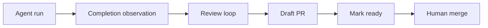

# Issue-Orchestrator

## What it is
Issue‑Orchestrator is a local-first control plane that turns GitHub issues into a managed agent workflow (code → review → PR), with guardrails for untrusted agents.

## Who it’s for
- Solo builders and small teams using coding agents on real repos
- People who want strong safety/guardrails (humans merge, verification, reconciliation)

## Who it’s not for
- Teams seeking a hosted SaaS orchestrator
- Workflows where agents must merge directly

## Guarantees (guardrails)
1) **Humans merge**: the orchestrator/agents never merge PRs.
2) **Write→Observe**: correctness-critical writes are verified by observation before state advances.
3) **Reconciliation-first**: drift pauses/quarantines work; state never “guesses”.

## Quickstart
```bash
python -m venv .venv && source .venv/bin/activate
pip install -e ".[dev]"
export ISSUE_ORCH_GITHUB_TOKEN=ghp_...
issue-orchestrator setup
issue-orchestrator run --once
```

## How it works
```mermaid
flowchart LR
  GH[GitHub state] --> OBS[Observe (snapshots)]
  OBS --> PLAN[Plan (Planner)]
  PLAN --> APPLY[Apply (ActionApplier)]
  APPLY --> GH
  APPLY --> EVT[Events/SSE]
  EVT --> UI[Web UI / Tests]
```



## Guardrails & boundaries
- Core: domain/control/ports contain no I/O
- Adapters perform GitHub/terminal/worktree I/O
- validate-before-push is authoritative; validation signature skip is preserved

## Links
- docs/design/BOUNDARIES.md
- docs/design/adr/
