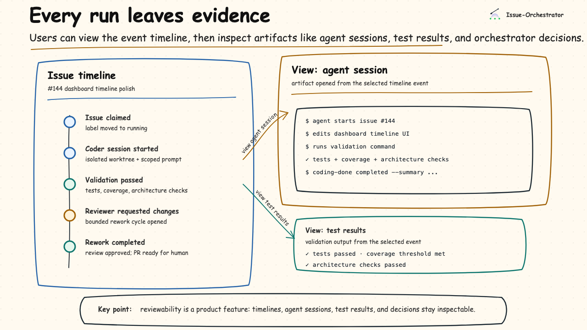

# Issue-Orchestrator: A Software Engineering Control Plane for Agentic Development

Explicit architecture checks, validation, review, recovery, and human approval around coding agents.

AI agents are very good at finishing bounded tasks.

They are not, by themselves, good stewards of large systems.

That distinction is what led me to build Issue-Orchestrator. It is for engineers who want to use coding agents without giving up the things that keep software maintainable: architecture boundaries, robust tests, coverage, review, scoped work, and human control over what lands.

Issue-Orchestrator does not know what "good" means for your codebase. It does not know your architecture, your testing strategy, your coverage expectations, your complexity tolerance, or whether an issue is scoped well.

You bring those standards. Agents can help draft them, but humans own them.

Issue-Orchestrator's job is to run agent work inside the checks and workflow rules you configure.

Prompting was not enough. Exhortation was not enough. What I needed was enforcement.

## The Basic Idea

Issue-Orchestrator takes small GitHub issues, runs coding agents in isolated worktrees, and only moves work forward when configured validation, review, recovery, and human-control rules are satisfied.

Agents can produce work.

The system decides whether that work advances, needs rework, or needs a human.

That is the core idea. Agent output is not authority. It is a claim the system evaluates.

## Three Things That Had to Become Explicit

After a lot of trial and error, I found that sustainable agentic development needed three things at the same time:

1. An explicit architecture
2. A deterministic workflow
3. Human-sized work managed outside the prompt

If any one of those is missing, the system starts to degrade.

## 1. Architecture Has to Be Explicit

If you cannot name your architecture, you probably do not have one.

In my case, I chose a hexagonal architecture. That was not about fashion. It was about enforceable boundaries. I wanted core logic separated from GitHub, terminals, storage, and UI concerns. I wanted the dependency direction to be obvious. I wanted violations to fail mechanically.

In Python, that meant:

- `import-linter` rules to prevent forbidden dependencies
- custom AST checks for constraints linters cannot express
- validation gates that run on demand, pre-push, and in CI

The important part is not that every project should use hexagonal architecture. That is just my choice for this system.

The important part is that the architecture is declared, and the project has checks that can detect drift.

Agents often route around inconvenient validation unless the system makes that path unavailable. Within the supported workflow, agents cannot advance work by bypassing validation. AI hooks, git hooks, orchestrator checks, and CI create independent enforcement layers.

The lesson was simple: architecture cannot live only in instructions to the agent. If it matters, make it checkable.

## 2. Workflow Has to Be Deterministic

Architecture protects structure. Workflow protects quality.

The workflow I settled on is intentionally boring:

1. Define small, human-reviewable tasks.
2. Assign each task to an agent type.
3. Run the agent in an isolated worktree.
4. Require configured validation before progress.
5. Run structured review.
6. If review fails, cycle through bounded rework.
7. Move stuck work to a blocked or needs-human state.
8. Leave humans in control of merge decisions.

The important part is not the exact steps. It is that the steps are enforced.

Agents do not decide that their work is good enough. The orchestrator decides based on configured validation, reviewer output, and explicit workflow state.

That means code quality is not maintained by ever-growing prompts. It is maintained by enforceable constraints, agentic review, and human review before merge.

## 3. Work Has to Be Externalized

At some point I realized I was reinventing task management badly.

So I leaned into GitHub issues and milestones.

GitHub provides a durable, shared source of intent. It gives humans visibility. It gives agents a bounded unit of work. It gives the orchestrator labels, dependencies, and state that survive process crashes.

This matters more than I expected.

Large goals need to become milestones. Milestones need to become human-sized issues. Issues need acceptance criteria, labels, dependencies, and enough context for an agent to attempt the work without inventing the project plan on the fly.

Issue-Orchestrator does not decompose your project for you. But it makes decomposition operational:

- issues hold intent
- milestones group work into phases
- labels route work and encode state
- dependencies make sequencing explicit
- pull requests make results reviewable

Agents are most useful when they receive bounded work. Complex, multi-step instructions tend to produce brittle execution and difficult review. Human-sized issues make agent work possible to inspect, recover, and integrate.

## What Issue-Orchestrator Actually Does

The system is designed as a headless control plane.

It:

- claims GitHub issues and assigns them to agent types
- runs agents concurrently in isolated worktrees
- prevents supported agents from advancing work by bypassing validation
- interprets structured completion output
- enforces validation and review cycles
- preserves in-flight work across crashes and restarts
- reconciles state with GitHub before mutating external state
- surfaces logs, timelines, transcripts, UI sessions, and structured events for review

The UI is just a client. The web dashboard is useful because it makes the workflow visible, but the core value is the control plane underneath it.

## GitHub Is Not a Database

This was harder than I expected.

GitHub is eventually consistent. Humans can change labels at any time. Processes crash. Main branches move. Provider APIs fail. Agents get stuck. Validation fails for good reasons and bad ones.

The system has to reconcile a deterministic workflow against an unreliable, human-mutable coordination substrate.

To handle that, the orchestrator:

- checks expected state before updates
- uses idempotent operations where possible
- reconciles state at startup and before mutation
- classifies failures as transient or fatal
- retries with jitter instead of thrashing
- opens circuit breakers during longer outages
- treats blocked and needs-human states as first-class outcomes

Failure is treated as normal, not exceptional.

That is one of the biggest differences between an agent demo and an agentic system.

## Reviewability Is a Product Feature

If agents are going to contribute to a real system, their work has to remain inspectable.

It is not enough to know that a run "completed." A human reviewer needs to see what happened: when the issue was claimed, which agent session ran, what validation produced, what the reviewer found, whether rework happened, and why the orchestrator moved the issue to the next state.

That is why Issue-Orchestrator treats timelines and artifacts as first-class product surfaces. Users can view the event timeline, then inspect artifacts like agent sessions, test results, validation output, and orchestrator decisions.

## Concurrency Without Chaos

The point of using agents is not just to run one task at a time. I wanted multiple agents working concurrently without turning the repository into a mess.

Issue-Orchestrator does that by making concurrency explicit.

Each issue lives in its own worktree. Each issue has a defined state machine. Each transition has rules. Dirty trees can be rejected. Validation must pass before moving forward. Review loops are bounded. Agents may declare failure, but they do not declare success unilaterally.

The goal is throughput without making discipline optional.

## How It Changed My Role

Dogfooding the system changed how I worked.

Instead of working directly on every code change, I found myself spending more time on the shape of the work:

- defining milestones
- identifying critical user journeys
- breaking them into right-sized issues
- tightening validation
- adding architecture checks
- reviewing PRs
- intervening when something was genuinely ambiguous

In some sense, I was promoted.

The work moved up a level. I was no longer just asking agents to code. I was designing the system they were allowed to code inside.

## Where Agents Can Help

There is a useful twist here.

Agents can help create the discipline too.

They can help draft architecture proposals, architecture checks, tests, coverage gates, linters, ADRs, milestones, scoped issues, reviewer prompts, and failure triage summaries.

But that help needs a human owner.

Agents can propose standards. Humans decide whether those standards are good enough to enforce.

That is the operating model: agents contribute inside constraints, and humans decide which constraints deserve authority.

## Related Thinking

After building this, I found Matt Pocock's AI Engineer Europe talk, "Software Fundamentals Matter More Than Ever," and it resonated strongly.

His point, as I heard it, is that AI does not make software fundamentals obsolete. It makes them more important. Good architecture, tests, domain language, and reviewable structure become the surface area that agents can work against.

Issue-Orchestrator is my attempt to operationalize that idea. It does not just argue that fundamentals matter. It gives agent work a workflow where configured validation, architecture checks, review, recovery, and human merge authority can actually be enforced.

## What This Is and Is Not

Issue-Orchestrator is not:

- a prompt collection
- a fully autonomous coding system
- a replacement for human judgment
- a tool optimized for one-off prompt-and-patch work

It is an opinionated system for treating AI agents as powerful but fallible contributors operating inside enforced engineering constraints.

There is no free lunch. Sustainable agentic development requires structure, validation, reviews, recovery, and human oversight.

Issue-Orchestrator is my attempt to make that workflow practical.

The goal is not to replace engineering discipline with agents. It is to let agents amplify that discipline: more parallel work, more reviewable progress, and more evidence about what changed.

That is the version of agentic development I want to build with.
